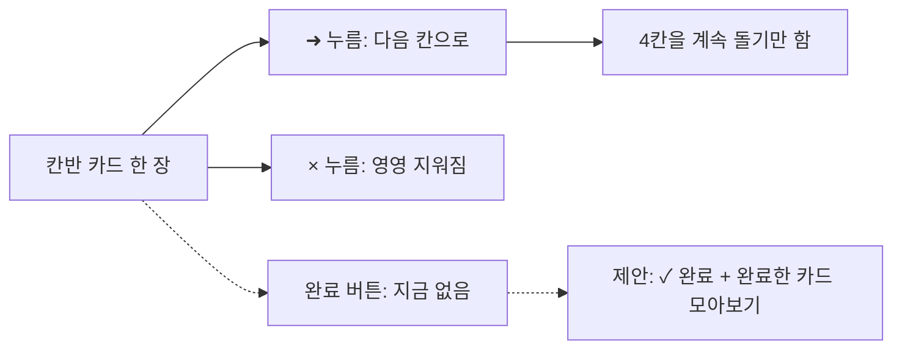
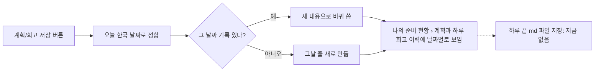

# 칸반 완료 · 준비 현황 · 회고 이력 · md 저장 — 지금 상태 (쉬운판)

> **최종 목표:** 칸반 완료 처리 · 나의 준비 현황 정리 · 계획/회고 이력 · 메모 md 저장, 이 4가지가 지금 어떻게 되어 있는지 정확히 알고, 다음에 무엇을 고칠지 내가 고를 수 있게 된다.
>
> 2026-10-02 · 조사만 함 (아무것도 고치지 않음) · 개발판: [fix-guide.md](fix-guide.md)

**핵심 한 줄:** 칸반에는 완료 버튼이 없고, 하루 끝 md 자동 저장도 없습니다. 계획·회고 이력은 이미 하루에 한 줄씩 쌓이고, 준비 현황의 두 칸은 입력하는 곳이 없어 늘 비어 있습니다.

**다음 행동 하나:** 맨 아래 '고를 것 3가지'에 답을 정해 도우미에게 알려 주세요.

## 핵심 기능 4가지

| 칸 | 무엇 | 지금 상태 |
|---|---|---|
| A | 칸반 카드 완료 처리 | **없음** — 옮기기(➜)·지우기(×)만 있음 |
| B | 나의 준비 현황의 개인 할 일·집중 시간 | **지워도 됨** — 입력하는 곳이 이미 없어 늘 비어 있음 |
| C | 계획과 하루 회고 이력 | **하루 한 줄** — 저장 버튼 누른 날만 쌓임 |
| D | 메모·실행 계획을 하루 끝에 md로 | **없음** — 회의록만 md 내려받기 가능 |

## 3줄 줄거리

1. 칸반 카드는 다음 칸으로 옮기거나 지우는 것만 되고, '끝났다'는 표시를 남길 곳이 없습니다.
2. 준비 현황의 '개인 할 일'·'집중 시간'은 입력 칸이 9월 29일에 빠져서 늘 0이며, 지울 때 위쪽 숫자 2개와 알림 2줄도 같이 정리해야 합니다.
3. 계획·회고는 이미 날짜별로 하루 한 줄씩 저장되고, 메모·계획을 하루 끝에 md 파일로 남기는 기능은 아직 없습니다.

지금 나는 [4가지 질문 확인] 중 [A. 칸반 완료 처리]의 [완료 버튼을 만들면 무엇이 같이 바뀌나]에 있다.

- 아직 모르는 것: 완료 표시를 새로 만들어도 옮기기·지우기·주간보고가 그대로 잘 될까?
- 확인하는 방법: 칸반 카드를 쓰는 곳을 모두 찾아본다 → **일부 확인**. 칸반 화면과 주간보고 두 곳이 카드를 읽습니다. 주간보고는 끝난 카드를 빼도록 같이 고쳐야 합니다.

## 과정

## 행동 지도

### A. 칸반 완료 처리 (자세히 본 칸)
- **현재 상황:** 카드에는 ➜(다음 칸으로)와 ×(지우기)만 있습니다. ➜는 4칸을 빙글빙글 돌기만 하고, ×는 카드를 완전히 지워 무엇을 끝냈는지 남지 않습니다. 주간보고는 '즉시처리·전략적계획' 카드를 가져다 쓰므로, 끝난 카드는 거기서 빠지게 같이 손봐야 합니다. 캡처의 같은 제목 3번 반복은 회의 메모에서 '칸반으로 보내기'를 여러 번 눌러 생긴 것으로 **추정**합니다 (실제 기록 미확인).
- **내가 할 일:** ① 완료한 카드를 어디에 둘지 — 추천: 4칸 아래 '완료한 카드' 접는 칸(완료 날짜·되돌리기) ② GitHub 이슈도 같이 닫을지 — 추천: 닫지 않음
- **도우미에게 부탁할 말:** "칸반 카드에 ✓ 완료 버튼을 추가해 줘. 완료한 카드는 4칸에서 빠지고, 아래 '완료한 카드' 칸에 완료 날짜와 함께 모아 보여 줘. 되돌리기 버튼도 넣어 줘. 완료한 카드는 주간보고의 할 일 목록에 나오지 않게 해 줘. GitHub 이슈는 닫지 마."
- **끝났는지 확인:** ✓를 누르면 카드가 '완료한 카드' 칸으로 옮겨지고, 되돌리기로 돌아오며, 주간보고 할 일 목록에 없다. 컴퓨터·휴대폰 화면에서 눌러 본 결과가 보고에 있다.

### B. 나의 준비 현황 정리
- **현재 상황:** 두 칸에 적어 넣는 곳은 9월 29일에 이미 빠졌습니다. 그래서 늘 비어 있고, 위쪽 '계획 대비 완료 0 / 0'과 '집중 시간 0분'도 늘 0입니다. 아침·저녁 카카오 개인 알림에도 이 두 줄이 들어갑니다.
- **내가 할 일:** ① 위쪽 숫자 2개도 지울지 — 추천: 지움 ② 알림 두 줄도 뺄지 — 추천: 뺌 ③ 예전 기록은 — 추천: 지우지 않고 보관
- **도우미에게 부탁할 말:** "나의 준비 현황에서 '개인 할 일', '집중 시간 기록' 칸을 지워 줘. 위쪽 숫자 중 '계획 대비 완료', '집중 시간'도 지우고 설명 문장도 맞게 고쳐 줘. 카카오 개인 알림에서도 그 두 줄을 빼 줘. 예전에 저장된 기록은 지우지 말고 그대로 둬."
- **끝났는지 확인:** 두 칸·두 숫자가 안 보이고, 결과 기록·회고 이력은 그대로 나온다. 알림 미리보기에 두 줄이 없다.

### C. 계획과 하루 회고 이력
- **현재 상황:** 이미 하루에 한 줄씩 쌓입니다. [저장하고 요청문 복사] 또는 [회고 저장]을 누르면 오늘 한국 날짜로 저장되고, 같은 날 다시 누르면 그날 내용을 바꿔 씁니다. 누르지 않은 날은 이력에 없습니다(9/30·10/2가 없는 이유로 추정). 오늘 계획 칸의 '○○○'는 어제(10/1) 회고의 '내일 첫 행동'을 미리 채워 준 것이고 아직 저장된 것이 아닙니다. 지난 날짜는 고칠 수 없습니다. 'personal-v1'은 그날 쓴 화면 버전 이름입니다.
- **내가 할 일:** 지금 직접 할 일 없음. 매일 저장 버튼을 누르는 것이 곧 하루 기준 업데이트입니다.
- **도우미에게 부탁할 말 (원할 때만):** "계획과 하루 회고 이력에서, 선택한 기간 중 저장하지 않은 날도 '기록 없음'으로 한 줄씩 보여 줘."
- **끝났는지 확인:** 오늘 계획 저장 후 [조회]하면 '2026-10-02 · 실행 계획'이 생기고, 다시 저장해도 2줄이 되지 않는다.

### D. 메모·실행 계획 md 저장
- **현재 상황:** 메모와 실행 계획은 사이트 안 저장소에만 있습니다. 하루 끝 md 저장은 없습니다. md로 받을 수 있는 곳은 회의록 화면뿐이고, 노트 저장소(ME)는 사이트가 읽기만 합니다.
- **내가 할 일:** ① 추천: 1단계로 [오늘 기록 md 내려받기] 버튼 ② '매일 밤 자동 저장'을 원하면 노트 저장소에 쓰기 권한을 줄지 결정 (큰 결정)
- **도우미에게 부탁할 말:** "개인 마이페이지에 [오늘 기록 md 내려받기] 버튼을 만들어 줘. 그날의 메모(시간순)와 실행 계획, 하루 회고를 한 파일로 묶어 줘. 파일 이름은 날짜로 해 줘. 노트 저장소에 자동으로 올리는 건 아직 하지 마."
- **끝났는지 확인:** 버튼을 누르면 날짜 이름의 md 파일이 받아지고, 화면과 같은 내용이 들어 있다.

## Before / After

| Before · 지금 (캡처 기준) | After · 예상 모형 (아직 만들지 않음) |
|---|---|
| 카드: `제목 ➜ ×` | 카드: `✓ 제목 ➜ ×` + 아래 '완료한 카드 n장' 접는 칸 |
| 위쪽 숫자: 결과 1건 · 계획 대비 완료 0/0 · 집중 시간 0분 | 위쪽 숫자: 결과 1건만 |
| 개인 할 일·집중 시간 칸 늘 빈칸 | 두 칸 없음 (예전 기록 보관) |
| 하루 끝 md 저장 없음 | [오늘 기록 md 내려받기] 버튼 → 원하면 자동 저장 |

## 확인한 것 / 남은 것

- 확인: 칸반 완료 기능 없음 · 할 일/집중 시간 입력 칸 9/29에 빠짐 · 계획/회고 하루 한 줄(재저장 시 바꿔 씀) · md 자동 저장 없음, 노트 저장소 읽기 전용
- 미확인: 칸반 중복 카드의 실제 이유(추정만) · 사이트를 직접 띄워 눌러 보지는 않음(캡처와 사이트 구성으로 확인)

### 고를 것 3가지
1. A: 완료한 카드를 '아래 접는 칸'에 둘까요? GitHub 이슈는 안 닫아도 될까요?
2. B: 위쪽 숫자 2개와 알림 2줄도 같이 지울까요?
3. D: 1단계 '내려받기 버튼'으로 시작할까요, 처음부터 '매일 밤 자동 저장'(노트 저장소 쓰기 권한 필요)을 원하나요?

## 그 뒤에 만든 것 (같은 날)

추천대로 A·B·D를 만들었습니다 (D는 내려받기 버튼부터).
- **A:** 칸반 카드 왼쪽 ✓를 누르면 아래 '완료한 카드'로 옮겨지고, [되돌리기]로 원래 칸에 돌아옵니다. 완료한 카드는 주간보고 할 일에서 빠집니다. GitHub 이슈는 닫지 않습니다.
- **B:** 나의 준비 현황에서 '개인 할 일'·'집중 시간 기록' 칸과 위쪽 숫자 2개를 뺐고, 카카오 개인 알림에서도 그 줄을 뺐습니다. 예전 기록은 지우지 않았습니다.
- **D:** 개인 마이페이지 메모 칸의 [md 내려받기]를 누르면, 메모 날짜에 고른 날의 실행 계획·메모·하루 회고가 날짜 이름의 파일 하나로 받아집니다.
- **사이트에 반영하기 전에 할 일:** 칸반 완료 기능을 쓰려면 Cloudflare D1 콘솔에 새 칸(0022)을 먼저 추가해야 합니다. 추가하기 전에도 화면은 그대로 뜨고, ✓만 안내 문구와 함께 막힙니다.
