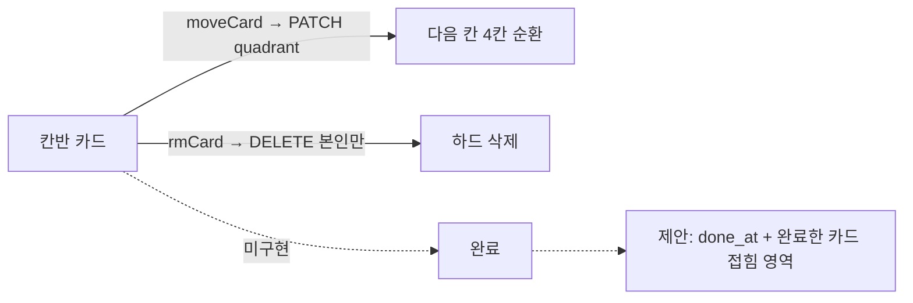
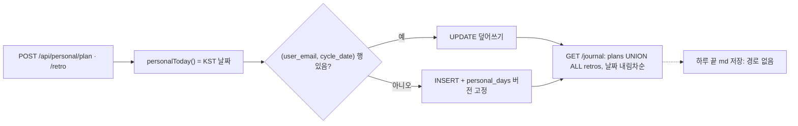

# 칸반 완료 · 준비 현황 · 회고 이력 · md 저장 — 개발 조사 (fix-guide)

> **최종 목표:** 4가지의 현재 구현을 파일·줄 근거로 확정하고, 에이전트에게 그대로 넘길 수 있는 수정 요청문과 완료 증거 기준을 남긴다.
>
> 2026-10-02 · 기준 커밋 `d902f89`(main) · 조사만, 코드 변경 없음 · 쉬운판: [easy-guide.md](easy-guide.md)

**핵심:** 칸반은 `quadrant` 하나로만 상태를 표현해 완료 컬럼이 없고(주간보고 쿼리도 함께 고쳐야 함), 하루 끝 md 저장은 어떤 경로에도 없습니다. 계획·회고는 이미 KST 하루 1행 UPSERT이며, 준비 현황의 할 일·집중 시간은 v44 이후 입력 경로가 없는 화면입니다.

**다음 행동 하나:** A·B·D의 선택 3가지를 정한 뒤 A 요청문부터 전달.

## 핵심 파일

| 파트 | 파일 | 역할 | 상태 |
|---|---|---|---|
| A | `public/kanban.html`, `src/routes/kanban.ts`, `src/report.ts` | 카드 렌더·이동/삭제, 주간보고 집계 | 완료 없음 |
| B | `public/personal-dashboard.html`, `public/personal-ui.js`, `src/personal.ts` | 준비 현황 화면·지표·개인 알림 | 입력 경로 없음 확인 |
| C | `src/personal.ts`(plan/retro/journal), `public/personal.html` | 하루 1행 저장·이력·프리필 | 하루 단위 확인 |
| D | `src/routes/schedule.ts`, `src/reminders.ts`, `src/vault.ts` | 메모 저장·cron·볼트(읽기 전용) | md 저장 없음 |

## 3줄 줄거리

1. 칸반 카드는 `quadrant`만 있어 ➜ 4칸 순환과 × 하드 삭제만 가능하고, 완료를 담을 컬럼이 없다.
2. 준비 현황의 tasks/focus는 v44에서 입력 폼이 빠져 늘 0이며, 지울 때 지표 2칸·알림 문구·테스트를 같이 정리해야 한다.
3. plans/retros는 서버 KST 날짜 기준 하루 1행 UPSERT로 이미 매일 쌓이고, 메모·계획을 md로 남기는 경로(버튼·cron·볼트 쓰기)는 없다.

지금 나는 [4가지 질문 확인] 중 [A. 칸반 완료 처리]의 [kanban_cards 를 읽는 곳 전수 확인]에 있다.

- **가설:** `done_at` 컬럼 하나를 추가하고 목록·주간보고에서 걸러내면 기존 이동·삭제·GitHub 연결은 깨지지 않는다.
- **검증:** `grep -rn kanban_cards src` 전수 확인(30분 상한) → **일부 확인**. 읽는 곳 2곳(`kanban.ts:12` 목록, `report.ts:131` 주간보고), 쓰는 곳 4곳(칸반 POST·PATCH·DELETE, `meetings.ts:186`·`:281` 변환). 주간보고에 `done_at IS NULL` 필터 필요. 구현 후 브라우저 검증은 미실행.

## 과정





## A. 칸반 완료 처리 (깊게 검증)

**현재 문제:** 카드 상태는 `quadrant` 하나. 화면 버튼은 ➜(`moveCard` → PATCH, 4칸 순환)와 ×(`rmCard` → DELETE, 본인 카드만 하드 삭제). 완료 컬럼 없음.

**같이 발견(범위 밖, 참고):**
- PATCH(`kanban.ts:41`)는 소유자 검사가 없어 회사 범위에서 남의 카드도 옮겨짐 (팀 보드라 의도일 수 있음 — 미확인)
- 주간보고 칸반 쿼리(`report.ts:131`)에 `scope` 필터가 없어 개인 카드가 회사 보고에 섞일 수 있음 (미검증)
- 회의 메모 → 칸반 변환(`meetings.ts:186, 281`)에 중복 방지가 없음. 캡처의 같은 제목 3회 반복은 이것으로 **추정** (운영 D1 미확인)

**사용자가 직접 할 일:** ① 완료 카드 위치 — 추천: 4사분면 아래 '완료한 카드' 접힘 영역 + 되돌리기 (대안: 5번째 '완료' 열) ② GitHub 연결 카드 완료 시 이슈 close — 추천: 닫지 않음

**그대로 전달할 에이전트 요청문:**

```text
목표: 칸반 카드에 '완료' 상태를 추가한다.
대상: feed-mina/work-cycle — public/kanban.html, src/routes/kanban.ts, src/report.ts, migrations/0022_kanban_done.sql(신규), tests/personal-mode.test.mjs
확인된 사실:
- 카드 상태는 quadrant 뿐이고, 버튼은 ➜(PATCH 4칸 순환)와 ×(DELETE 하드 삭제)만 있다.
- src/report.ts:131 이 즉시처리·전략적계획 카드를 상태 구분 없이 주간보고에 넣는다.
미확정 가설: 캡처의 중복 카드는 회의 메모→칸반 변환을 여러 번 눌러 생긴 것 (이번 범위 아님).
맡길 범위:
1) 0022: ALTER TABLE kanban_cards ADD COLUMN done_at TEXT; (재실행 불가 — DEPLOY.md 형식으로 콘솔 적용 절차와 d1_migrations 보정 SQL 주석 포함)
2) PATCH /api/kanban/:id 가 {done:true|false} 도 받도록 확장 (done_at = datetime('now') / NULL). quadrant 변경 동작은 그대로.
3) 화면: 카드에 ✓ 버튼, 완료 카드는 4칸에서 빼고 아래 '완료한 카드 (n)' 접힘 영역에 완료 날짜 + 되돌리기. 사분면 카드 수(n장)와 '즉시처리 3장 초과' 경고는 미완료만 센다.
4) report.ts 칸반 쿼리에 done_at IS NULL 추가.
5) GitHub 이슈는 닫지 않는다. ➜·× 동작, 회사/개인 scope 분리, 삭제 권한은 바꾸지 않는다.
완료 기준: 테스트에 완료/되돌리기/주간보고 제외 검사 추가 후 통과, 1280·420 화면에서 ✓→접힘 영역 이동과 되돌리기를 Playwright로 확인한 스크린샷.

공통 규칙: AGENTS.md 2-1(tsc · 인라인 JS 문법 검사 · wrangler dev --local + Playwright로 부품별 조작 · 1280/420 가로 넘침 0)을 지키고, PR 본문에 무엇을 어떻게 검증했는지 적어 줘. 지정 브랜치에서만 작업하고 운영 D1에는 직접 손대지 마(마이그레이션 SQL과 콘솔 적용 절차만 docs/DEPLOY.md 형식으로 남겨 줘).
```

**완료 증거:** PR 링크·0022 SQL·DEPLOY.md 콘솔 블록 / tsc·인라인 JS·테스트 출력 원문 / 1280·420 스크린샷(✓ 전후, 접힘 영역, 되돌리기) / 주간보고 미리보기에서 완료 카드 제외 화면

**실패하면:** 운영 D1에 0022 적용 전 배포되면 칸반 목록이 `no such column: done_at`으로 500. 'D1 콘솔 적용 → 배포' 순서와 v43 같은 컬럼 부재 방어 코드를 요청.

**근거:** `public/kanban.html:71`(NEXT), `:87-88`(버튼), `:95-96`(moveCard·rmCard) · `src/routes/kanban.ts:12, 41, 137` · `src/report.ts:131` · `src/routes/meetings.ts:186, 281` · `migrations/0001, 0002, 0006, 0020`

## B. 나의 준비 현황 정리

**현재 문제:** v44(`5b98c0d`)에서 입력 폼(`personalTaskForm`, `personalFocusForm`)이 화면에서 빠졌고 테스트 9행이 '폼 없음'을 강제. 같은 데이터에서 나오는 것: 지표 '계획 대비 완료'·'집중 시간', 지표 설명 문장, 개인 알림(08:25·17:40)의 두 줄과 미완료 할 일 줄(`buildPersonalReminder`). 카드만 지워도 `rows()`는 대상이 없으면 넘어가므로 오류는 없음. `refresh()` 진입 조건(`personalFilters` 존재)은 유지해야 결과 기록·이력이 계속 뜸.

**사용자가 직접 할 일:** ① 지표 2개도 지울지 — 추천: 지움 ② 알림 줄 제거 — 추천: 제거 ③ 테이블·API — 추천: 보존

```text
목표: 입력 경로가 없는 '개인 할 일'·'집중 시간'을 나의 준비 현황 화면과 개인 알림에서 정리한다.
대상: public/personal-dashboard.html, public/personal-ui.js, src/personal.ts(buildPersonalReminder), tests/personal-mode.test.mjs
확인된 사실: v44(5b98c0d)에서 입력 폼이 빠져 personal_tasks/personal_focus 에 새 데이터가 들어오지 않는다. 지표 '계획 대비 완료'·'집중 시간'과 08:25/17:40 개인 알림 문구가 이 데이터를 쓴다.
맡길 범위:
1) personal-dashboard.html 에서 pd-tasks, pd-focus 카드와 지표 2칸(personalDoneCount, personalMinutes)을 지우고 지표 설명 문장을 '결과는 저장한 기록 건수입니다'로 맞춘다.
2) personal-ui.js 에서 지운 요소를 쓰는 줄을 정리한다(없는 요소 접근으로 오류가 나지 않게). refresh() 는 personalFilters 가 있으면 계속 실행.
3) buildPersonalReminder 의 '계획 대비 완료', '집중 시간' 줄과 미완료 할 일 줄을 뺀다.
4) personal_tasks·personal_focus 테이블과 /api/personal/tasks·focus API, personalSummary 응답 모양은 지우지 않는다(기존 테스트 114행 유지).
완료 기준: 테스트에 '두 카드·두 지표 없음'과 알림 미리보기 문구 검사 추가 후 통과, 1280/420 스크린샷에서 결과 기록·회고 이력이 그대로 보임.

공통 규칙: AGENTS.md 2-1(tsc · 인라인 JS 문법 검사 · wrangler dev --local + Playwright로 부품별 조작 · 1280/420 가로 넘침 0)을 지키고, PR 본문에 무엇을 어떻게 검증했는지 적어 줘. 지정 브랜치에서만 작업하고 운영 D1에는 직접 손대지 마(마이그레이션 SQL과 콘솔 적용 절차만 docs/DEPLOY.md 형식으로 남겨 줘).
```

**완료 증거:** 1280/420 스크린샷(카드 6 → 4) · `/api/personal/reminders/preview` 응답 원문 · 테스트 출력 원문

**실패하면:** 아코디언(`acc.js`)이 `data-acc` 키로 접힘 상태를 기억하므로, 남은 카드의 `data-acc`가 바뀌지 않았는지 먼저 확인 요청 (AGENTS.md v5 id 충돌 사례).

**근거:** `public/personal-dashboard.html:25, 28` · `public/personal-ui.js:16-28, 45, 56` · `src/personal.ts:165-191, 193, 241` · `tests/personal-mode.test.mjs:9, 11, 114`

## C. 계획과 하루 회고 이력 — 구현 로직

1. 저장: `POST /api/personal/plan`, `/retro`가 서버 `personalToday()`(UTC+9 = KST 날짜)를 `cycle_date`로 씀. 클라이언트 날짜는 받지 않음.
2. 키: `(user_email, cycle_date)` UPSERT — 같은 날 재저장은 덮어쓰기.
3. 그날 첫 저장 때 `personal_days`에 화면 버전(`personal-v1`) 고정 → 이력 제목 끝 버전 표시.
4. 조회: `GET /api/personal/journal?from&to`가 plans·retros를 UNION ALL, 날짜 내림차순. 기본 기간 '이번 주'(월~오늘).
5. 다음 날 연결: `/plan/prefill`이 오늘 이전 최근 회고의 `tomorrow_prompt`를 '오늘 이룰 것'에 미리 채움. 캡처의 '○○○'·'📌 2026-10-01 회고에서'가 이것이며 오늘 저장된 계획이 아님.

한계: 저장 안 한 날은 행이 없어 빈 날 표시 없음 · 지난 날짜 수정 불가 · 회고 본문은 라벨 없이 세 칸을 줄바꿈으로 이어 붙임. 9/30·10/2 부재는 저장 안 함으로 **추정**(운영 D1 미확인).

**사용자가 직접 할 일:** 지금 직접 할 일 없음.

```text
(선택) 목표: 계획과 하루 회고 이력을 날짜 기준으로 더 읽기 쉽게 한다.
대상: public/personal-ui.js(journal 렌더), src/personal.ts(GET /journal)
확인된 사실: plans/retros 는 (user_email, cycle_date) 하루 1행 UPSERT, 날짜는 서버 KST. 저장 안 한 날은 행이 없다.
맡길 범위:
1) 선택 기간의 날짜마다 한 묶음(계획/회고)으로 보여 주고, 둘 다 없는 날은 '기록 없음'으로 표시한다(주말 포함 여부는 기간 그대로).
2) 회고 본문에 retroLabels 라벨을 붙여 세 칸을 구분한다(계획의 [라벨] 형식과 같게).
3) 저장 키·UPSERT·personal_days 버전 고정은 바꾸지 않는다.
완료 기준: 9/28~10/2 기간에서 9/30이 '기록 없음'으로 보이는 로컬 스크린샷, 기존 테스트 통과.

공통 규칙: AGENTS.md 2-1(tsc · 인라인 JS 문법 검사 · wrangler dev --local + Playwright로 부품별 조작 · 1280/420 가로 넘침 0)을 지키고, PR 본문에 무엇을 어떻게 검증했는지 적어 줘. 지정 브랜치에서만 작업하고 운영 D1에는 직접 손대지 마(마이그레이션 SQL과 콘솔 적용 절차만 docs/DEPLOY.md 형식으로 남겨 줘).
```

**근거:** `src/personal.ts:12, 40-43, 80, 89, 101, 210` · `public/personal.html:480-506` · `public/personal-ui.js:34-35, 37`

## D. 메모·실행 계획 md 저장

**현재 문제:** 메모 = `schedule_logs`, 실행 계획 = `personal_plans`, 회고 = `personal_retros`, 모두 D1에만 있음. md 내보내기는 회의 쪽(`/api/notes/:id/export?fmt=md`)뿐. cron은 카카오 알림 슬롯만 처리. 볼트(feed-mina/ME)는 `src/vault.ts:8`에 '읽기만 한다'로 설계.

선택지: ① [오늘 기록 md 내려받기] — 서버가 그날 메모+계획+회고를 md로 조립해 첨부 응답 (외부 쓰기 없음, 추천 1단계) ② 매일 23:50 KST 자동 ME 커밋 — 쓰기 토큰(`contents:write`) 필요, 볼트 읽기 전용 원칙 변경, cron 표현식에 UTC 14시 추가(표현식 1개 유지 가능), 회사 데이터 커밋 금지(AGENTS 2-3) 때문에 개인용 기록만 대상.

**사용자가 직접 할 일:** ① ①로 시작할지 ②까지 원하는지 결정 — 추천: ① 먼저 ② ②를 원하면 ME 쓰기 토큰 발급과 저장 폴더 경로를 직접 정함

```text
목표: 개인 마이페이지에서 그날의 메모·실행 계획·하루 회고를 md 파일 하나로 내려받는다(1단계).
대상: src/personal.ts(또는 src/routes/schedule.ts), public/personal.html, tests/personal-mode.test.mjs
확인된 사실: 메모는 schedule_logs, 계획은 personal_plans, 회고는 personal_retros 에만 있고 md 내보내기·하루 끝 저장·볼트 쓰기는 없다. 회의 메모 md 내보내기(src/routes/meetings.ts:301)의 Content-Disposition 방식이 있다.
맡길 범위:
1) GET /api/personal/day.md?date=YYYY-MM-DD — 본인 기록만, 날짜 검증(validDate), '# 날짜' 아래 ## 실행 계획(라벨 포함) / ## 메모(일정 제목별 시간순, 답글 들여쓰기) / ## 하루 회고 순서. 빈 칸은 '기록 없음'.
2) 메모 카드의 날짜 선택과 같은 날짜로 [md 내려받기] 버튼 추가. 파일명 YYYY-MM-DD_work-cycle.md.
3) 볼트 쓰기·cron 추가·토큰 추가는 하지 않는다. 회사용 데이터는 넣지 않는다(개인용 scope 기록만).
완료 기준: 로컬에서 버튼으로 받은 파일 원문과 화면 내용 대조표, 다른 사용자 기록이 섞이지 않는 테스트, 잘못된 날짜 400 테스트.

공통 규칙: AGENTS.md 2-1(tsc · 인라인 JS 문법 검사 · wrangler dev --local + Playwright로 부품별 조작 · 1280/420 가로 넘침 0)을 지키고, PR 본문에 무엇을 어떻게 검증했는지 적어 줘. 지정 브랜치에서만 작업하고 운영 D1에는 직접 손대지 마(마이그레이션 SQL과 콘솔 적용 절차만 docs/DEPLOY.md 형식으로 남겨 줘).
```

**근거:** `migrations/0013_schedule_logs.sql`, `0021` · `src/routes/schedule.ts:112-203` · `src/routes/meetings.ts:301` · `src/reminders.ts:234, 298` · `wrangler.toml:36` · `src/vault.ts:8`

## Before / After

| Before · 지금 (캡처 기반 재구성) | After · 예상 모형 (미구현) |
|---|---|
| 카드 `제목 ➜ ×` | `✓ 제목 ➜ ×` + '완료한 카드 n장' 접힘 영역 |
| 지표: 결과 1건 · 0/0 · 0분 | 지표: 결과 1건 |
| 할 일·집중 시간 카드 빈칸 | 카드 없음, 테이블·API 보존 |
| md 저장 없음 | [오늘 기록 md 내려받기] → (선택) 자동 커밋 |

## 근거·검증 이력

| 항목 | 방법 | 판정 |
|---|---|---|
| 칸반 완료 기능 없음 | kanban.html·kanban.ts 전문, 마이그레이션 컬럼 | 확인 |
| 완료 추가 시 영향 범위 | `kanban_cards` grep 전수 | 일부 확인 (구현 전) |
| 중복 카드 원인 | meetings.ts 변환 코드, 운영 D1 미조회 | 미확인(추정) |
| tasks/focus 입력 경로 없음 | public·src grep, v44 커밋·테스트 9행 | 확인 |
| plans/retros 하루 1행 | UPSERT·personalToday·journal 쿼리 | 확인 |
| 하루 끝 md 저장 없음 | md/download grep, SLOTS·crons, vault.ts 주석 | 확인 |
| 로컬 실행·브라우저 조작 | — | 미실행 (조사 요청이라 코드 경로로 확인) |
| 보고서 HTML | Playwright 1280/420: 가로 넘침 0, 중복 id 0, 내부 링크 깨짐 0, A~D 클릭·키보드 선택 | 확인 |

## 후속 구현 (v45, 같은 날 사용자 승인: A·B·D 추천안, D는 내려받기 버튼부터)

| 파트 | 구현 | 검증 |
|---|---|---|
| A | `migrations/0022_kanban_done.sql`(done_at) · PATCH `{done}` · ✓ 버튼 · '완료한 카드' 접힘 영역(완료 날짜·되돌리기) · 주간보고 `done_at IS NULL` · 0022 미적용 D1 방어(`hasKanbanDone`, 60초 캐시) · GitHub 이슈는 닫지 않음 | 0022 적용 전 로컬에서 PATCH 400(안내 문구)·목록/주간보고 200 확인 → 적용 후 테스트(완료·중복 완료·되돌리기·주간보고 제외/복귀), Playwright 1280/420 클릭·키보드 |
| B | 나의 준비 현황에서 개인 할 일·집중 시간 카드와 지표 2칸 제거, 개인 알림에서 두 줄·미완료 할 일 줄 제거. 표·API 보존 | 테스트(요소 제거·유지, 알림 미리보기), Playwright 카드 4개·콘솔 오류 0 |
| D | `GET /api/personal/day.md?date=` + 개인 마이페이지 메모 카드 [md 내려받기]. 개인용 일정 메모만, 본인 기록만, 외부 쓰기 없음 | 테스트(내용·파일명·타 사용자 격리·잘못된 날짜 400), Playwright 다운로드 파일명(오늘·이전 날짜) |

공통: `tsc --noEmit` · 인라인 JS 검사 · 테스트 129 checks PASS · wrangler dry-run · 1280/420 가로 넘침 0.
운영 반영 전 **D1 콘솔에 0022 적용**이 필요합니다 (`docs/DEPLOY.md`).
