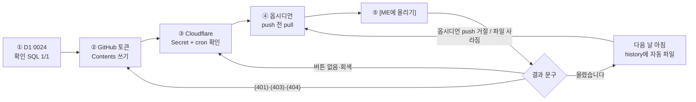

# v47·v48 운영 반영 1~4 따라하기 (쉬운판)

> **최종 목표:** v47·v48 운영 반영을 끝낸다: 메모 수정 이력이 쌓이고, 매일 23:50·00:10에 하루 기록이 ME 저장소 history/에 자동으로 올라가며, 옵시디언 동기화도 깨지지 않는 상태.
>
> 2026-10-02 · easy-guide · PR feed-mina/work-cycle#27 머지 후 설정 · 개발판: [fix-guide.md](fix-guide.md)

**핵심 한 줄:** 코드는 이미 배포됐고, 남은 일은 사용자가 직접 하는 설정 4가지 — ① D1 표 · ② GitHub 토큰 쓰기 권한 · ③ Cloudflare에 이메일을 **Secret**으로 · ④ 옵시디언 pull 먼저 — 와 ⑤ 버튼 한 번으로 확인입니다.

**다음 행동 하나:** ①의 확인 SQL부터. **③은 반드시 Secret** (Text로 넣으면 다음 배포 때 지워집니다).

## 3줄 줄거리

1. v47(메모 수정 이력)·v48(ME history 자동 올리기) 코드는 배포됐지만, 운영 DB·토큰·변수가 없으면 이력은 안 쌓이고 올리기는 꺼진 채입니다.
2. ①은 D1 콘솔 SQL, ②는 GitHub 토큰 권한, ③은 Cloudflare Secret과 cron 확인, ④는 옵시디언 동기화 설정 — 모두 사용자 화면에서 하는 일입니다.
3. ⑤에서 버튼 한 번으로 성공 문구와 GitHub history 파일을 보고, 다음 날 아침 자동 파일까지 보면 끝입니다.

지금 나는 [v47·v48 운영 반영] 중 [③ Cloudflare 설정]의 [Text가 아니라 Secret이어야 하는 이유]를 깊게 확인했다.

## 흐름 지도 (flow map)



## 1. D1에 0024 적용

_지금 나는 [v47·v48 운영 반영] 중 [1. D1에 0024 적용]에 있다._

### 현재 상황

[아직 모름] 메모 수정 이력을 담을 표가 운영 DB에 있는지 확인이 필요합니다. 표가 없어도 메모 수정은 되지만 **수정 전 내용이 쌓이지 않습니다**.

### 내가 할 일

1. > 📍 Cloudflare 대시보드 → 왼쪽 **Storage & Databases** → **D1 SQL Database** → **work-cycle 사이트가 쓰는 DB** → 위쪽 **Console** 탭

⚠️ 지난번 캡처의 DB 이름은 `private-cycle-work-db`였습니다. 어떤 DB인지 헷갈리면 **Workers & Pages → work-cycle → Settings → Bindings**에서 **DB** 줄에 적힌 이름을 고르세요. 0022·0023을 적용한 그 DB입니다.

2. 먼저 **확인**을 실행합니다. (개발판의 ‘확인 SQL’을 복사해 붙여넣기)
3. 결과가 **1 / 1**이면 이 단계는 끝입니다. 하나라도 **0**이면 아래 세 줄을 **한 줄씩** 실행합니다(모두 다시 실행해도 안전).

(개발판 ① 칸의 ‘표 만들기 · 색인 · 기록’ 세 줄)

4. 다시 확인 → **1 / 1**.

### 도우미에게 부탁할 말

```text
(에이전트는 Cloudflare 콘솔에 들어갈 수 없습니다 — 직접 할 일)
결과 화면을 보내며: "0024 확인 SQL 결과야. 맞게 적용됐는지 봐 줘."
```

### 끝났는지 확인하는 법

확인 SQL 결과 **rev_table 1 · rec_0024 1** 화면.

### 안 될 때

- "schedule_logs 표가 없다"는 오류 → 다른 DB를 연 것입니다. Bindings에서 이름을 다시 확인하세요.
- 그 밖의 오류 → 오류 문구를 그대로 도우미에게 보내세요.

## 2. GitHub 토큰에 쓰기 권한

_지금 나는 [v47·v48 운영 반영] 중 [2. GitHub 토큰 쓰기 권한]에 있다._

### 현재 상황

[아직 모름] 지금 **GITHUB_TOKEN_VAULT**는 회의록을 **읽기** 위해 만든 토큰입니다. ME 저장소에 파일을 **쓰려면** 쓰기 권한이 필요합니다. Cloudflare에 저장된 토큰 값은 다시 볼 수 없어서, **새 토큰을 만들어 바꿔 끼우는 방법**이 가장 확실합니다.

### 내가 할 일

**A. GitHub에서 새 토큰 만들기**

1. > 📍 github.com → 오른쪽 위 프로필 사진 → **Settings** → 왼쪽 맨 아래 **Developer settings** → **Personal access tokens** → **Fine-grained tokens** → **Generate new token**
2. **Token name**: `work-cycle-vault` · **Expiration**: 원하는 기간(예: 1년 — 만료되면 올리기가 멈추니 달력에 갱신일을 적어 두세요)
3. **Resource owner**: `feed-mina` · **Repository access**: **Only select repositories** → `feed-mina/ME` 하나만
4. **Permissions → Repository permissions → Contents**: **Read and write** (Metadata: Read-only는 자동으로 켜짐)
5. **Generate token** → 나온 값(github_pat_…)을 바로 복사. **이 화면을 닫으면 다시 볼 수 없습니다.**

**B. Cloudflare에 바꿔 끼우기**

1. > 📍 Cloudflare → **Workers & Pages** → **work-cycle** → **Settings** → **Variables and Secrets**
2. **GITHUB_TOKEN_VAULT** 줄의 편집(연필 또는 ⋯ → Edit) → 새 값 붙여넣기 → 저장(**Deploy**). 줄이 없으면 **+ Add** → Type **Secret** → 이름 `GITHUB_TOKEN_VAULT`.

_참고: 기존 토큰이 fine-grained라면 그 토큰의 Edit에서 Contents만 Read and write로 바꿔도 됩니다. classic 토큰(repo 권한)은 이미 쓰기가 되지만 모든 저장소에 권한이 있어 범위가 넓습니다._

### 도우미에게 부탁할 말

```text
(에이전트는 GitHub 설정·Cloudflare Secret에 들어갈 수 없습니다 — 직접 할 일)
5단계 [ME에 올리기] 결과 문구를 보내며: "ME에 올리기 결과야. 토큰 권한이 맞는지 봐 줘."
```

### 끝났는지 확인하는 법

5단계에서 "ME history/… 에 올렸습니다". 토큰 값 자체는 누구에게도 보내지 마세요.

### 안 될 때

- `(401) Bad credentials` → 값을 잘못 붙였거나 만료. 새로 만들어 다시 넣기.
- `(403) Resource not accessible by personal access token` → Contents가 Read and write가 아님.
- `(404) Not Found` → Repository access에 feed-mina/ME가 빠짐.

## 3. Cloudflare에 VAULT_HISTORY_EMAIL

_지금 나는 [v47·v48 운영 반영] 중 [3. Cloudflare 변수와 cron]에 있다._

### 현재 상황

[꺼져 있음] 이 값이 없으면 올리기 기능 전체가 꺼져 있고 버튼도 보이지 않습니다. **누구의 기록을 올릴지** 정하는 값이라, 다른 사람 기록이 ME에 섞이지 않게 막아 줍니다.

> **Text가 아니라 Secret으로 넣어야 합니다.** git push로 자동 배포될 때 대시보드에서 넣은 Text 변수는 지워지고, Secret은 남습니다(설치된 wrangler 설명문으로 확인).

### 내가 할 일

1. > 📍 Cloudflare → **Workers & Pages** → **work-cycle** → **Settings** → **Variables and Secrets** → **+ Add**
2. **Type**: **Secret** · **Variable name**: `VAULT_HISTORY_EMAIL` · **Value**: work-cycle 화면 오른쪽 위에 보이는 **내 로그인 이메일**(화면에 보이는 그대로, 한 글자도 다르지 않게)
3. **Deploy**(또는 Save).
4. **cron 확인**: 같은 Settings 화면의 **Trigger Events**(Cron Triggers)에 `0,10,25,30,40,50 23,1,3,4,8,14,15 * * *`가 보이면 됩니다. 예전 표현식(`0,25,30,40 23,1,3,4,8 * * *`)이 보이면 **연필로 수정**해 위 값으로 바꾸세요 — **+ Add로 하나 더 만들지 마세요**(알림이 두 번 갑니다).
5. 개인 마이페이지를 `Ctrl+Shift+R`로 새로고침 → 메모 칸에 **[ME에 올리기]**가 보이면 끝.

### 도우미에게 부탁할 말

```text
(직접 할 일) 버튼이 안 보이면: "VAULT_HISTORY_EMAIL을 Secret으로 넣었는데 [ME에 올리기]가 안 보여. /api/vault-history/status 결과야: (결과 붙이기)"
```

### 끝났는지 확인하는 법

개인 마이페이지에 [ME에 올리기] 버튼이 보이는 화면 + Trigger Events 화면.

### 안 될 때

- 버튼이 안 보임 → 넣은 이메일이 로그인 이메일과 다른지 확인.
- 버튼이 회색 → 마우스를 올리면 이유가 보입니다(예: 토큰 없음 → 2단계).
- 며칠 뒤 버튼이 사라짐 → Text로 넣은 것. Secret으로 다시 넣기.

## 4. 옵시디언 Git: push 전에 pull

_지금 나는 [v47·v48 운영 반영] 중 [4. 옵시디언 Git 동기화]에 있다._

### 현재 상황

[아직 모름] 지금까지 ME 저장소는 옵시디언 쪽에서만 올렸습니다. 이제 work-cycle도 **history/**에 파일을 올리므로, 옵시디언이 **먼저 받아온 뒤(pull) 올려야(push)** 합니다. 아니면 옵시디언의 다음 올리기가 거절될 수 있습니다. 어떤 방식으로 동기화하는지는 제가 볼 수 없어 **미확인**입니다.

### 내가 할 일

**Obsidian Git 플러그인을 쓰는 경우**

1. > 📍 Obsidian → 왼쪽 아래 **설정(톱니)** → **커뮤니티 플러그인** → **Git** 옆 톱니(옵션)
2. ‘pull’이 들어간 항목을 켭니다: **시작할 때 pull**(Pull on startup), **push 전에 pull**(Pull before push), 자동 동기화를 쓰면 **자동 pull 간격**(Auto pull interval)도 분 단위로.
3. 설정 이름은 플러그인 버전마다 조금 다를 수 있습니다 — ‘pull’이 들어간 항목을 찾으면 됩니다.

**다른 방식(직접 git, 스크립트, 다른 앱)인 경우**: 올리기 전에 항상 `git pull`을 먼저 하도록 바꿔 주세요. **강제 올리기(--force)**를 쓰는 방식이면 history 파일이 지워지니 꼭 바꿔야 합니다.

### 도우미에게 부탁할 말

```text
(직접 할 일) 동기화 방식이 헷갈리면: "내 ME 저장소는 (Obsidian Git / 스크립트 / 기타)로 GitHub에 올려. 설정 화면 캡처 보낼게, push 전에 pull 하는지 봐 줘."
```

### 끝났는지 확인하는 법

5단계 첫 업로드 뒤 옵시디언에서 동기화 → **history 폴더가 옵시디언에 보이고**, 그 뒤 옵시디언 올리기가 오류 없이 됨.

### 안 될 때

- 옵시디언에서 `rejected`·`non-fast-forward` 오류 → pull을 한 번 실행한 뒤 다시 push.
- 다음 날 GitHub에서 history 파일이 사라짐 → 강제 올리기를 쓰는 동기화입니다. 방식을 알려 주세요.

## 5. 한 번 눌러 확인

_지금 나는 [v47·v48 운영 반영] 중 [5. 최종 확인]에 있다._

### 현재 상황

1~4가 끝나면 지금 바로 한 번 올려 보고, 다음 날 아침에 자동으로 올라왔는지 확인합니다.

### 내가 할 일

1. 개인 마이페이지 메모 칸 → 메모 날짜를 오늘로 → **[ME에 올리기]**
2. 메모 칸 위에 "ME history/2026-10-02_work-cycle.md 에 올렸습니다"가 뜨면 성공
3. > 📍 github.com/feed-mina/ME → **history** 폴더 → 오늘 파일을 열어 [md 내려받기] 파일과 같은지 확인
4. **다음 날 아침**: 같은 폴더에 어젯밤 파일이 있고, 커밋 메시지가 `work-cycle: 날짜 하루 기록`인지 확인
5. 메모를 하나 고친 뒤 md를 받아 **✎ 수정 이력**이 보이면 1단계도 확인 완료

### 도우미에게 부탁할 말

```text
"ME에 올리기 결과 문구와 GitHub history 폴더 캡처야. v47·v48 운영 반영 끝났는지 확인해 줘."
```

### 끝났는지 확인하는 법

성공 문구 화면 · GitHub history 폴더 화면 · 다음 날 자동 커밋 1개.

### 안 될 때

- "올릴 기록이 없습니다" → 그날 계획·회고·일정·메모가 하나도 없음(정상).
- "내용이 같아 그대로 둡니다" → 이미 같은 내용이 올라가 있음(정상).
- GitHub 오류 문구 → 2단계 실패 표 참고, 문구를 그대로 보내 주세요.
- 밤 사이 자동으로 안 올라옴 → 3단계 cron 표현식 확인.

## Before / After

| Before · 지금 (설정 전 모형) | After · 예상 모형 (1~4 완료 후) |
|---|---|
| 메모 칸: `md 내려받기`만 | 메모 칸: `md 내려받기` `ME에 올리기` + "ME history/… 에 올렸습니다" |
| ME 저장소에 `history/` 없음 | `history/2026-10-02_work-cycle.md` (커밋: work-cycle: 2026-10-02 하루 기록), 다음 날부터 매일 자동 |

## 확인한 것 / 남은 것

- **확인**: v47·v48 코드 — 로컬 테스트 153 + 28개 통과, 가짜 GitHub로 올리기·덮어쓰기·403 원문 확인, 23:50/00:10 cron 처리 실행 (2026-10-02)
- **확인**: 배포 때 Text 변수 삭제·Secret 유지, cron은 설정 파일 값으로 교체 — 설치된 wrangler 설명문·코드 기준
- **미확인**: 운영 D1의 0024 적용 여부 · 현재 토큰 종류와 권한 · 옵시디언 동기화 방식 · 운영 빌드가 같은 배포 명령을 쓰는지
- **미실행**: 실제 ME 저장소 쓰기 — ②·③ 뒤 ⑤에서 처음 실행
