# work-cycle 화면-코드 인수인계

화면에 보이는 값 하나에서 시작해 **담당 코드 → 처리 규칙 → 저장 필드 → 화면 결과**까지 따라갈 수 있게 정리한 문서입니다.
제품 배경을 모르는 개발자가 화면 하나를 열어 유지보수할 수 있는 것을 목표로 합니다.
작업 규칙은 [`../../AGENTS.md`](../../AGENTS.md), 현재 상태와 남은 일은 [`../HANDOFF.md`](../HANDOFF.md), 배포 절차는 [`../DEPLOY.md`](../DEPLOY.md)에 있습니다.

## 0. 목적과 읽는 순서

| 항목 | 내용 |
|---|---|
| 대상 소스 | `feed-mina/work-cycle` `main` (커밋 `b5a5da3`, v28 개인용 화면까지) |
| 배포 주소 | https://<your-worker>.workers.dev (Cloudflare Access 뒤. 이 문서의 캡처는 운영 데이터가 아니라 로컬 실행 화면) |
| 독자·범위 | 처음 이 코드를 맡는 개발자. 화면 8개 + 화면 없는 기능(알림·OAuth·위젯 API) + D1 저장 구조 + 실행·배포·복구 |
| 화면 기준 | **실제 앱 렌더링** — `npx wrangler dev --local`로 띄운 뒤 Chromium(Playwright)으로 캡처. 데이터는 설명용 예시(`dev@example.test`, `teammate@example.test`) |
| 읽는 순서 | 1장 전체 구조 → 2장 화면별(S01~S08) → 3장 화면 없는 기능(S09) → 4장 저장 구조·ERD → 5장 실행·배포·복구 → 6장 검수표 |
| 번호 규칙 | 화면 `S01`~`S09`, 캡처 안 영역 `①②③`, 흐름도·상세 표의 단계 `F1`~`Fn`을 같은 번호로 씁니다 |

> 캡처 원본은 `assets/pages/`(전체 화면, 데스크톱 1280·모바일 420)와 `assets/components/`(확대)에 있습니다.
> 흐름도·관계도는 Mermaid 원본을 본문에 두고, 렌더링 확인용 SVG를 `assets/diagrams/`에 같이 둡니다.

---

## 1. 제품이 하는 일과 전체 구조

### 1-1. 무엇을 하는 도구인가

대표 피드백 3원칙(고객 니즈 파악 · AI 과신 지양 · 검증과 테스트 습관화)을 **하루 6단계 사이클**로 매일 강제하는 사내 도구입니다.
사용자는 아침에 회의록을 읽고(④), 질문 템플릿을 쓰고(⑦), 체크리스트를 누르며 일하고(⑤), 검증 표를 남기고(②), 공유하고(③), 회고를 쓴다(⑥).
각 단계는 **실제 기록이 D1에 생겨야 완료**로 바뀌며, 카카오톡 알림이 평일 시간표대로 남은 항목을 알려줍니다.

| 단계 코드 | 화면 표시 | 완료 판정 근거 (회사용 `/api/board`) |
|---|---|---|
| `read` | 회의록 읽기 08:30 | `meeting_reads`에 **전 영업일** 회의록 읽음 기록, 또는 `step_marks` |
| `plan` | 질문 템플릿 09:30 | `ai_requests`에 오늘 행, 또는 `step_marks` |
| `work` | 체크리스트 (작업 중) | `checks`에 오늘 **활성 항목 19개 이상** (`CHECKLIST_COMPLETE_MIN`) — 수동 표시 불가 |
| `verify` | 검증 기록 16:50 | `verifications`에 오늘 1행 이상 — 수동 표시 불가 |
| `share` | 보고·공유 17:20 | `step_marks`의 수동 [완료 표시]만 |
| `retro` | AI 회고 17:50 | `retros`에 오늘 행, 또는 `step_marks` |

### 1-2. 기술 구성과 요청 처리 경로

| 계층 | 구성 | 쉬운 뜻 |
|---|---|---|
| 인증 | Cloudflare Zero Trust Access | 로그인 화면은 Cloudflare가 대신 띄우고, 앱은 `Cf-Access-Authenticated-User-Email` 헤더로 사용자를 압니다. 앱 안에 로그인 코드가 없습니다 |
| 정적 화면 | Workers Assets `public/` | 빌드 도구 없는 순수 HTML/CSS/JS. `/schedule` → `public/schedule.html` |
| API(Application Programming Interface, 프로그램의 요청·응답 창구) | Hono 앱 `src/index.ts` (+ `src/personal.ts`) | `/api/*`, `/auth/*`만 Worker가 먼저 받습니다 (`wrangler.toml`의 `run_worker_first`) |
| DB(Database, 데이터베이스) | Cloudflare D1 `work-cycle-db` (SQLite) | 모든 기록. 로컬은 `.wrangler/state`의 SQLite 파일 |
| AI | Workers AI(`@cf/google/gemma-4-26b-a4b-it`) → 실패 시 Gemini API | 회의록 요약과 주간보고 문장 다듬기 |
| 외부 연동 | Kakao(나에게 보내기) · Google Calendar(일정·Meet) · GitHub(이슈·옵시디언 볼트 읽기) | 토큰은 D1 `oauth_tokens`, 시크릿은 `wrangler secret` |
| 스케줄 | Workers Cron 표현식 1개 | `scheduled()`가 KST 시각을 보고 `SLOTS`에서 갈라 보냅니다 |

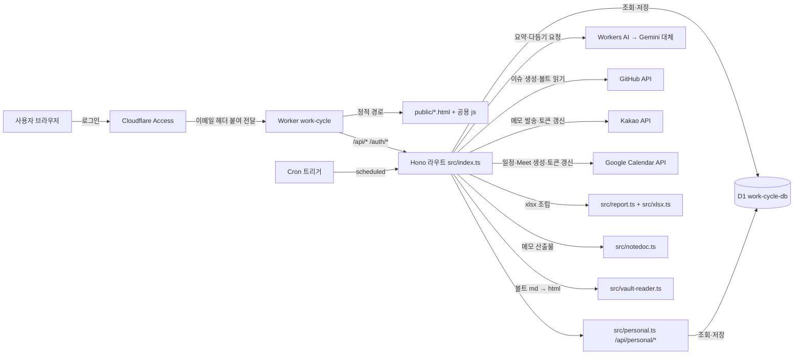
```mermaid
flowchart LR
  U[사용자 브라우저] -->|로그인| A[Cloudflare Access]
  A -->|이메일 헤더 붙여 전달| W[Worker work-cycle]
  W -->|정적 경로| P[public/*.html + 공용 js]
  W -->|/api/* /auth/*| H[Hono 라우트 src/index.ts]
  H --> PS[src/personal.ts /api/personal/*]
  H -->|조회·저장| D[(D1 work-cycle-db)]
  PS -->|조회·저장| D
  H -->|요약·다듬기 요청| AI[Workers AI → Gemini 대체]
  H -->|이슈 생성·볼트 읽기| GH[GitHub API]
  H -->|메모 발송·토큰 갱신| KK[Kakao API]
  H -->|일정·Meet 생성·토큰 갱신| GC[Google Calendar API]
  C[Cron 트리거] -->|scheduled| H
  H -->|xlsx 조립| X[src/report.ts + src/xlsx.ts]
  H -->|메모 산출물| N[src/notedoc.ts]
  H -->|볼트 md → html| V[src/vault-reader.ts]
```

화살표 뜻: 왼쪽이 오른쪽을 **호출**합니다. D1로 가는 선은 조회와 저장 둘 다입니다.

**한 요청이 지나가는 길** (`/api/*` 기준)

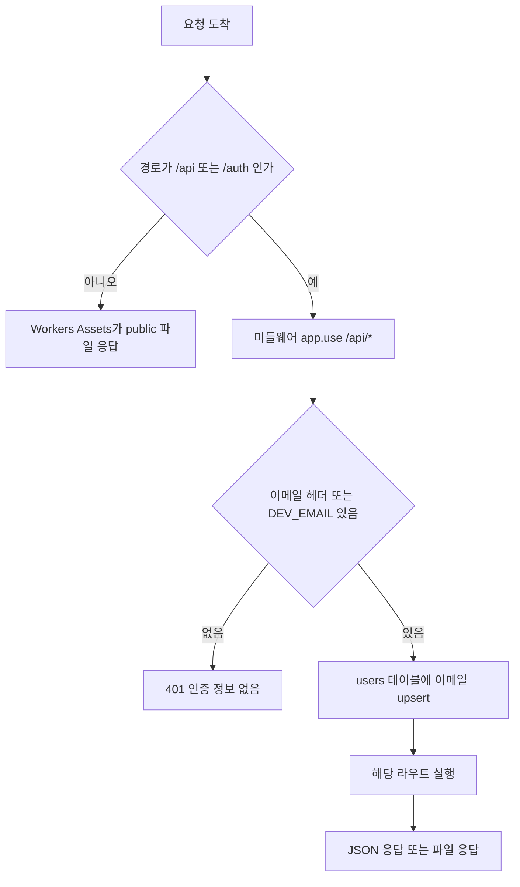
```mermaid
flowchart TD
  R[요청 도착] --> Q{경로가 /api 또는 /auth 인가}
  Q -->|아니오| S[Workers Assets가 public 파일 응답]
  Q -->|예| M[미들웨어 app.use /api/*]
  M --> E{이메일 헤더 또는 DEV_EMAIL 있음}
  E -->|없음| X[401 인증 정보 없음]
  E -->|있음| UP[users 테이블에 이메일 upsert]
  UP --> RT[해당 라우트 실행]
  RT --> J[JSON 응답 또는 파일 응답]
```

- 미들웨어는 `src/index.ts`의 `app.use("/api/*")`. **모든 API 호출마다** `users`에 `INSERT ... ON CONFLICT DO NOTHING`을 합니다. 팀 화면에 사람이 보이는 근거가 여기입니다.
- `/auth/*`는 미들웨어 밖이라 `authEmail(c)`로 헤더를 직접 읽습니다.
- 로컬은 `.dev.vars`의 `DEV_EMAIL`이 헤더를 대신합니다. 테스트는 헤더를 직접 넣어 여러 사용자를 흉내 냅니다.

### 1-3. 화면 목록과 담당 코드

| 화면 | 경로 | HTML | 주로 부르는 API | 저장 테이블 |
|---|---|---|---|---|
| S01 마이페이지 | `/` | `public/index.html` | `/api/board`, `/api/widget/now`, `/api/schedules`, `/api/work-logs`, `/api/plan*`, `/api/retro`, `/api/habits*`, `/api/checklist`, `/api/checks`, `/api/verifications`, `/api/reminders/*` | `step_marks`, `schedules`, `schedule_logs`, `ai_requests`, `retros`, `habit_*`, `checks`, `checklist_notes`, `verifications`, `oauth_tokens` |
| S02 스케줄 | `/schedule` | `public/schedule.html` | `/api/cycle_history`, `/api/schedules`, `/api/month` | `schedules` (+ 사이클 테이블 읽기) |
| S03 회의록 | `/meetings` | `public/meetings.html` | `/api/notes*`, `/api/meetings*`, `/api/vault/*`, `/api/ai/usage`, `/api/git_targets` | `meeting_notes`, `meetings`, `meeting_reads`, `ai_usage`, `kanban_cards`, `git_targets` |
| S04 칸반 | `/kanban` | `public/kanban.html` | `/api/kanban*`, `/api/github/issues` | `kanban_cards` |
| S05 검증 대시보드 | `/dashboard` | `public/dashboard.html` | `/api/dashboard`, `/api/verifications/:id` | `verifications` |
| S06 주간보고 | `/report` | `public/report.html` | `/api/report/*` | `report_settings`, `report_overrides` (+ 주간 기록 읽기) |
| S07 개인 마이페이지 | `/personal` | `public/personal.html` | `/api/personal/*` (+ 스케줄·메모·퀵기록은 회사 API 그대로) | `personal_*` |
| S08 나의 준비 현황 | `/personal-dashboard` | `public/personal-dashboard.html` | `/api/personal/dashboard`, `/api/personal/journal` | `personal_*` |
| S09 화면 없는 기능 | — | — | `scheduled()`, `/auth/*`, `/api/widget/now`, `/api/downloads/desktop-banner`, `/api/team-membership/leave` | `oauth_tokens`, `team_membership_exits` |

### 1-4. 모든 화면에 붙는 공용 부품

각 HTML은 마지막에 같은 순서로 공용 스크립트를 부릅니다. 한 번만 설명하고 화면 절에서는 링크만 답니다.

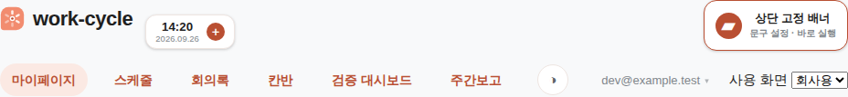

| 파일 | 역할 | 화면에서 만드는 것 | 저장 위치 |
|---|---|---|---|
| `public/theme.js` | 다크 모드 토글, 공용 오류 타입 `ApiError` | 헤더 `◑` 버튼. `api()`가 alert 후 던진 `ApiError`는 `unhandledrejection`에서 조용히 삼킵니다 | `localStorage['wc-dark']` |
| `public/quick.js` | 시계 칩 + **퀵 기록 모달**, 바탕화면 배너 모달, **계정 메뉴** | `.clock-chip`, `#qkModal`, `#bannerModal`, `.acct-menu` | 퀵 기록은 D1 `habit_*`; 배너 문구는 `localStorage['wc.desktopBanner.text']` |
| `public/membership.js` | 계정 메뉴에 [팀 멤버에서 나가기] 추가 | `/api/me`의 `team_member`로 상태 표시 | D1 `team_membership_exits` |
| `public/acc.js` | 카드 접기·펴기(`data-acc`), 카드 안 섹션 2중 아코디언(`.secx`), `/#verif` 같은 해시 진입 | `<h2>`를 버튼으로 바꾸고 나머지를 `.acc-body`로 감쌉니다 | `localStorage['wc.acc.<키>']`, `['wc.acc.sec.<카드>.<섹션>']` |
| `public/principles.js` | **3원칙 배너** (헤더 바로 아래) | 세 카드 → `/#plan`, `/#check`, `/#verif`로 이동 | `localStorage['wc.prin.open']` |
| `public/mode-switch.js` | 헤더의 **사용 화면(회사용/개인용)** 선택 | 저장 후 `/personal` 또는 `/`로 이동. 개인용이면 다른 화면의 탭 링크를 `/personal`, `/personal-dashboard`로 바꿉니다 | D1 `personal_settings.view_mode` |
| `public/edit.js` | **검증 기록 편집 모달** `openVerifModal`, **일정 편집 모달** `openSchedModal` | S01·S02·S05가 공용으로 사용 | `verifications`, `schedules` |
| `public/personal-edit.js` | `edit.js`와 같은 모달이지만 결과 기록은 `/api/personal/verifications`로 보냄 | S07·S08 | `personal_results`, `schedules` |
| `public/personal-ui.js` | 개인 3원칙 카드, 폼 라벨 치환, 알림 모드, 화면 버전 이력 | S07·S08 | `personal_*` |
| `public/ext.js` | **비어 있는 확장점**. 파생 저장소가 통째로 교체하는 파일 | 없음 | 없음 |

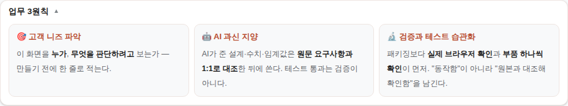

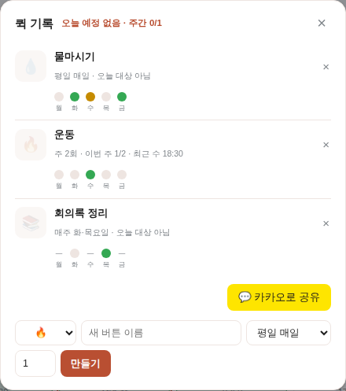

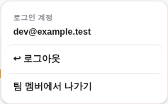

- 아코디언은 `data-acc-default="closed"`인 카드(퀵 기록·리마인드·보고서 기본 정보 등)를 처음엔 접습니다. 캡처는 모두 펼친 상태입니다.
- 각 HTML의 인라인 `api()`는 실패 시 서버가 준 `error` 문구를 그대로 `alert`합니다. 외부 API 오류 원문을 덮지 않는 규칙(AGENTS.md 2-4)의 화면 쪽 구현입니다.

---

## 2. 화면별 설명

### S01 마이페이지 `/` — 오늘 사이클을 한 화면에서 채우기

오늘의 6단계 상태, 이번 주 일정, 업무 메모, 질문 템플릿·회고, 퀵 기록, 알림 연결, 체크리스트, 검증 기록이 **위에서 아래로** 놓입니다. 각 카드에서 저장하면 맨 위 사이클 보드가 다시 그려집니다.

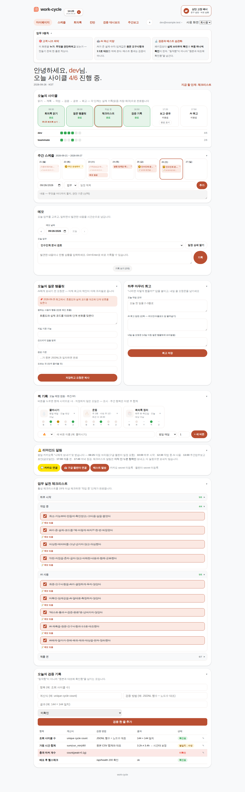

모바일(420) 전체 캡처: [`assets/pages/S01-home-mobile.png`](assets/pages/S01-home-mobile.png) — 사이클 카드가 3열 2행, 주간 스케줄이 세로로 쌓입니다. 가로 넘침 0.

| 번호·영역 | 무엇을 보여주나 | 연결 코드·데이터 |
|---|---|---|
| ① 인사 문구 | 이름(이메일 앞부분), 오늘 완료 단계 수 `n/6`, 지금 할 단계 | `loadBoard()` → `/api/widget/now`, `/api/board` |
| ② 사이클 보드 | 6단계 카드(완료=초록), 팀원별 점 6개 | `/api/board`의 `board[]`, `step_meta` |
| ③ 주간 스케줄 | 월~일 7칸, 내 일정은 클릭 가능. `?` 표시는 요구사항 한 줄 미확인 | `/api/schedules?from&to`, `openSchedModal` |
| ④ 메모 | 오늘 업무를 골라 시간순 메모 | `/api/work-logs`, `/api/schedules/:id/logs` |
| ⑤ 질문 템플릿 · 회고 | 좌: 오늘 요청문(어제 회고 프리필) / 우: 하루 회고 | `/api/plan/prefill`, `/api/plan`, `/api/retro` |
| ⑥ 퀵 기록 | 습관 버튼 + 이번 주 월~금 점 | `/api/habits`, `/api/habits/:id/tap` |
| ⑦ 리마인드 알림 | 카카오·구글 연결 상태, 테스트 발송 | `/api/reminders/status`, `/auth/*/start`, `/api/reminders/test` |
| ⑧ 체크리스트 | 섹션별 항목, 항목별 메모 | `/api/checklist`, `/api/checks`, `/api/checklist/:id/memo` |
| ⑨ 검증 기록 | 오늘 검증 표, 내 행은 클릭해 편집 | `/api/verifications`, `openVerifModal` |

#### S01-A 사이클 보드 — 오늘 6단계와 팀원 진행 표시

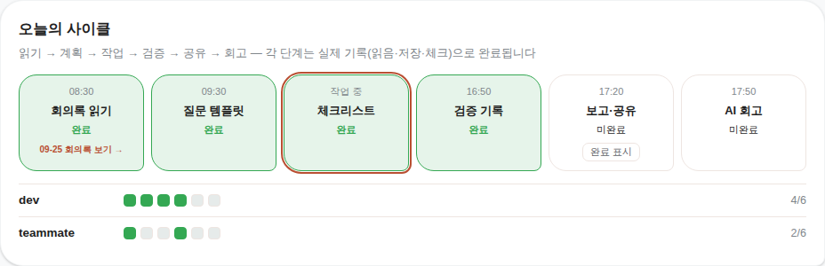

| 핵심 파일·심볼 | 역할 |
|---|---|
| `index.html` `loadBoard()` | 두 API를 부른 뒤 카드 6개와 팀원 행을 그립니다. 다른 카드가 저장할 때마다 다시 부릅니다 |
| `index.ts` `GET /api/widget/now` | KST 현재 시각으로 "지금 할 단계"를 정합니다 |
| `index.ts` `GET /api/board` | 팀 전원의 오늘 단계 완료 여부를 7개 쿼리로 모아 판정합니다 |
| `index.ts` `POST /api/step_marks` | 수동 [완료 표시]. `read/plan/share/retro`만 허용 |
| `index.ts` `meetingReadSourceDate()` | 오늘 읽어야 할 회의록 날짜(전 영업일) |

| 단계·담당 함수 | 받는 값 | 처리·조건 | 반환값·부수 효과 | 화면 또는 다음 소비자 |
|---|---|---|---|---|
| F1 `loadBoard()` | 없음 (`ME`, `TODAY` 전역) | 두 요청을 순서대로 | 없음. DOM `#cycle`, `#team`, `#heroDone` 갱신 | ①② |
| F2 `GET /api/widget/now` | 없음 | KST 시각 h: `<9.5` read, `<10.5` plan, `<16:50` work, `<17:20` verify, `<17:50` share, 그 외 retro | `{date, current, meta}` | ① "지금 할 단계", 카드의 `now` 테두리 |
| F3 `GET /api/board` | `date`(선택, 기본 오늘) | 팀원 목록(나간 계정 제외) + `checks`(활성 항목 distinct 수)·`verifications`·`step_marks`·`meeting_reads`(전 영업일 회의록)·`ai_requests`·`retros`를 **병렬**(`Promise.all`) 조회 | `{date, meeting_read_date, step_meta, board:[{email,name,steps,done,total}]}` | ② |
| F4 판정 | F3 결과 | 표 1-1 규칙. `work`는 `n >= 19`, `verify`는 1건 이상, `share`는 수동만 | `steps` 6개 불리언 | 카드 색, 팀원 점 |
| F5 `markStep(step)` | 단계 코드 | `POST /api/step_marks` → `step_marks` UNIQUE라 중복은 무시 | `{ok}` → `loadBoard()` 재호출 | ② |

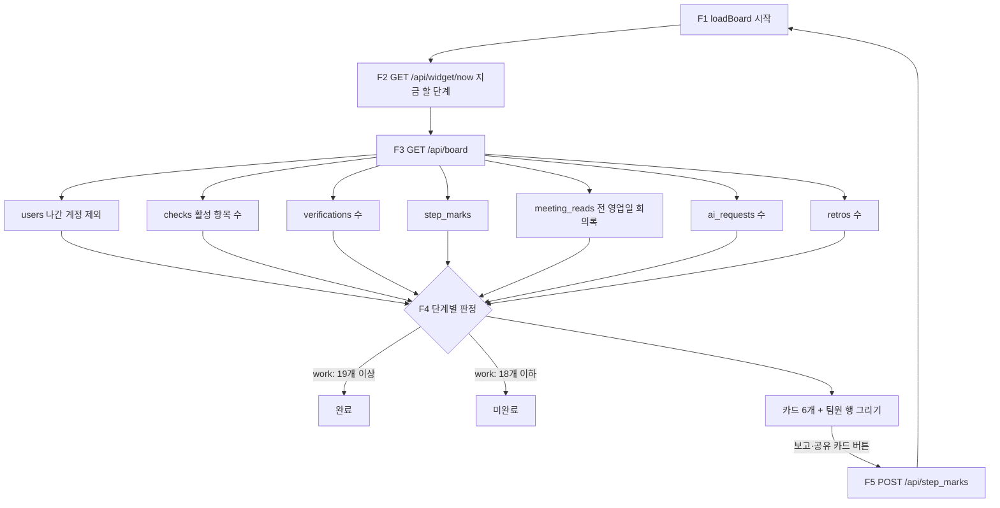
```mermaid
flowchart TD
  F1[F1 loadBoard 시작] --> F2[F2 GET /api/widget/now 지금 할 단계]
  F2 --> F3[F3 GET /api/board]
  F3 --> P1[users 나간 계정 제외]
  F3 --> P2[checks 활성 항목 수]
  F3 --> P3[verifications 수]
  F3 --> P4[step_marks]
  F3 --> P5[meeting_reads 전 영업일 회의록]
  F3 --> P6[ai_requests 수]
  F3 --> P7[retros 수]
  P1 & P2 & P3 & P4 & P5 & P6 & P7 --> F4{F4 단계별 판정}
  F4 -->|work: 19개 이상| D1[완료]
  F4 -->|work: 18개 이하| D2[미완료]
  F4 --> R[카드 6개 + 팀원 행 그리기]
  R -->|보고·공유 카드 버튼| F5[F5 POST /api/step_marks]
  F5 --> F1
```

P1~P7은 **동시에** 실행됩니다(순차 아님). `read` 카드는 클릭하면 `/meetings?tab=list&date=<전 영업일>`로 이동해 옵시디언 가져오기를 바로 열 수 있습니다.

| API·저장 연결 | 실제 내용 |
|---|---|
| 요청과 응답 | `GET /api/board?date=` → `board[].steps.{read,plan,work,verify,share,retro}`; `POST /api/step_marks {step, date?}` |
| 읽기·쓰기 | 읽기 `users, checks⋈checklist_items, verifications, step_marks, meeting_reads⋈meetings, ai_requests, retros`; 쓰기 `step_marks(user_email, cycle_date, step)` |
| 수정 위치·영향 | 완료 기준을 바꾸려면 `CHECKLIST_COMPLETE_MIN`(보드·도넛 달력 공용)과 `index.html`의 안내 문구 "19개 이상"을 함께. 단계 시각은 `STEP_META`와 `/api/widget/now`의 경계 둘 다 |
| 수정 후 확인 | 체크 18개 → 보드 `work` 미완료, 19개 → 완료. `/api/board`와 `/api/cycle_history` 값이 같은지 대조 |

> **알림과의 차이**: 저녁 점검 알림 `buildReminder("evening")`은 `work`를 `checks` **1건 이상**으로 셉니다. 보드(19개)와 기준이 다르므로 알림 문구와 화면이 어긋날 수 있습니다. 통일하려면 `buildReminder`의 `checks` 쿼리를 보드와 같은 조건으로 바꿔야 합니다.

#### S01-B 주간 스케줄과 일정 편집 모달 — 일정 등록·완료·요구사항 한 줄 확인

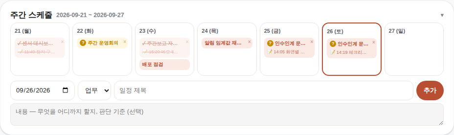

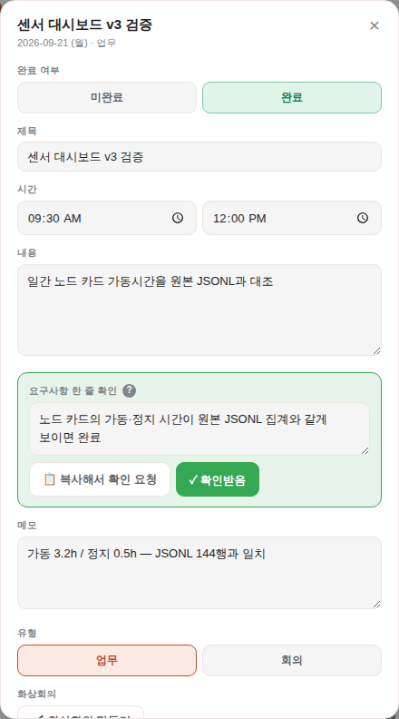

| 핵심 파일·심볼 | 역할 |
|---|---|
| `index.html` `loadWeek()` / `weekDates()` | KST 기준 이번 주 월~일 7일을 만들고 팀 전체 일정을 그립니다 |
| `edit.js` `openSchedModal(row, onSaved)` | 일정 한 건의 편집 모달. 저장·삭제·화상회의·요구사항 확인 버튼을 담당 |
| `index.ts` `GET /api/schedules` | 기간 내 **모든 팀원** 일정 + 내 일정에만 최신 메모 1건 |
| `index.ts` `POST/PATCH/DELETE /api/schedules(/:id)` | 등록·수정·삭제. 수정·삭제는 본인 것만 |
| `index.ts` `scheduleType()` | 유형은 `업무` 또는 `회의` 두 가지로 정규화 |

| 단계·담당 함수 | 받는 값 | 처리·조건 | 반환값·부수 효과 | 화면 또는 다음 소비자 |
|---|---|---|---|---|
| F1 `schForm` submit | `date, block_type, title, body` | `POST /api/schedules`. 제목·날짜 필수, 상태 기본 `미완료` | `{ok, id}`. `schedules` 1행 | 주간 칸 다시 그림, 메모 카드 업무 목록 갱신 |
| F2 `loadWeek()` | 월~일 날짜 7개 | `GET /api/schedules?from&to`. 나간 팀원 일정 제외. `latest_log`는 내 것만 서브쿼리 | `rows[]` (`start_time`, `end_time`, `status`, `confirm_line`, `confirmed`, `memo`, `meet_url`…) | 칸 안의 태그. `mine`이면 `clickable` |
| F3 태그 클릭 → `openSchTag()` | `data-sid` | `SCH_ROWS`에서 행을 찾아 `openSchedModal` | 모달 DOM | 모달 |
| F4 모달 [저장] | 제목·시간·내용·유형·상태·확인 한 줄·확인 여부·메모 | `PATCH /api/schedules/:id`. 본인 소유 확인(404), 상태는 `미완료/완료`만, 빈 시간은 `NULL` | `{ok}` → `onSaved()` | F2 재실행 + 메모 카드 갱신 |
| F5 [복사해서 확인 요청] | 확인 한 줄 | 클립보드에 "[제목] 요구사항 확인 … 이렇게 이해한 게 맞을까요?" 문구 복사 | 없음(클립보드) | 요청자에게 붙여넣기 |
| F6 [화상회의 만들기] | 일정 id | `POST /api/schedules/:id/meet` → S09-C 참고 | `{meet_url}` | 모달 다시 열면 참여·복사·공유 버튼 |
| F7 `×` / [삭제] | 일정 id | `DELETE /api/schedules/:id`. `schedule_logs`는 `ON DELETE CASCADE` | `{deleted}` | F2 |

| API·저장 연결 | 실제 내용 |
|---|---|
| 읽기·쓰기 | `schedules(id, user_email, date, block_type, title, start_time, end_time, body, memo, status, confirm_line, confirmed, meet_url, meet_event_id, created_by)`. 열 이름은 `start_time`/`end_time`입니다 (`start`/`end` 아님) |
| 화면 규칙 | `?` 배지 = 내 일정 & 미완료 & `confirm_line` 비어 있음. 초록 테두리 = `confirmed=1` |
| 수정 위치·영향 | 유형을 늘리려면 `scheduleType()`, `edit.js`의 `BLOCKS`, `index.html`/`schedule.html` 폼 `<option>`, 주간보고의 `kind` 표시가 함께 바뀝니다 |
| 수정 후 확인 | 일정 등록 → 주간 칸 표시 → 모달 저장 → 새로고침 후 값 유지. 다른 이메일로 같은 일정 PATCH 시 404 |

#### S01-C 메모 — 오늘 업무에 시간순 기록 쌓기

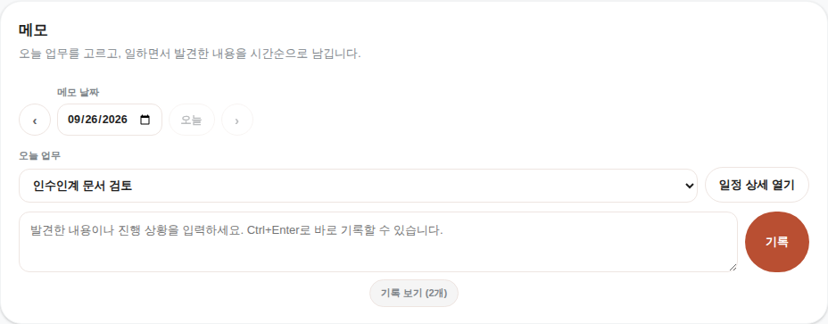

| 단계·담당 함수 | 받는 값 | 처리·조건 | 반환값·부수 효과 | 화면 또는 다음 소비자 |
|---|---|---|---|---|
| F1 `loadWorkLogs(preferId)` | `WORKLOG_DATE`(기본 오늘) | `GET /api/work-logs?date=`. 내 `업무` 일정(미완료 먼저)과 그날 메모 최대 100건 | `{date, schedules, logs}` | 업무 선택 드롭다운, 정리 메모, 기록 목록. 오늘이 아니면 입력 폼 숨김 |
| F2 `worklogForm` submit | `body`(1~1000자) | `POST /api/schedules/:id/logs`. 본문 4KB 초과 413, 내 일정 아님 404, `회의` 유형 400, **오늘 날짜 일정이 아니면 400** | `{id, logged_date, logged_time}` (KST HH:MM) | "저장됨 HH:MM", 주간 칸의 📝 갱신 |
| F3 [수정]/[삭제] | 메모 id | `PATCH /api/work-logs/:id` (prompt로 편집) / `DELETE` — 내 것만 | `{ok}` | F1 |
| F4 [일정 상세 열기] | 선택된 업무 | S01-B 모달 | — | — |

- "정리 메모"(`schedules.memo`, 모달에서 편집)와 "시간순 메모"(`schedule_logs`)는 다른 저장소입니다. 주간보고(S06)는 둘 다 진행사항으로 씁니다.
- 수정 위치: 글자 수 상한은 서버 `WORK_LOG_BODY_MAX`와 D1 `CHECK (length(body) BETWEEN 1 AND 1000)` 둘 다. 한쪽만 바꾸면 500이 납니다.

#### S01-D 질문 템플릿(⑦)과 회고(⑥) — 어제 회고가 오늘 요청문이 되는 고리

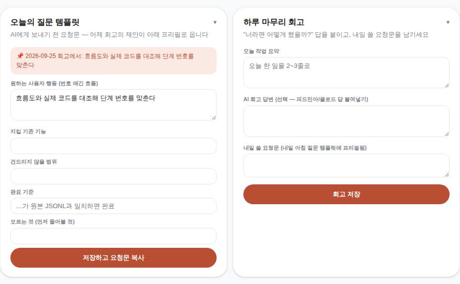

| 단계·담당 함수 | 받는 값 | 처리·조건 | 반환값·부수 효과 | 화면 또는 다음 소비자 |
|---|---|---|---|---|
| F1 `loadPrefill()` | 없음 | `GET /api/plan/prefill`: `tomorrow_prompt`가 비어 있지 않은 **가장 최근** 회고 1건 + 오늘 `ai_requests` | `{prefill:{id,cycle_date,tomorrow_prompt}, today}` | 안내 줄 📌, `user_flow`가 비어 있으면 채움. `PREFILL_ID` 보관 |
| F2 `planForm` submit | `user_flow`(필수), `keep`, `dont_touch`, `done_criteria`, `unknowns` | `POST /api/plan`. 서버가 5줄 `[원하는 사용자 행동] …` 형식의 `final_prompt`를 조립해 `ai_requests`에 INSERT(`reused_from`=F1의 회고 id) | `{ok, final_prompt}` → 클립보드 복사 | 보드 `plan` 완료 |
| F3 `retroForm` submit | `work_summary`(필수), `ai_answer_md`, `tomorrow_prompt` | `POST /api/retro` → `retros` INSERT (오늘 날짜 고정, 하루 여러 행 가능) | `{ok}` | 보드 `retro` 완료, 내일 F1 프리필 |

- 회사용은 **하루에 여러 행**이 쌓입니다(INSERT). 개인용(S07)은 같은 날 1행으로 덮어씁니다(UPSERT). 집계 코드를 옮길 때 이 차이를 유지해야 합니다.
- 프리필 규칙을 "어제만"으로 바꾸려면 `/api/plan/prefill`의 `ORDER BY cycle_date DESC LIMIT 1` 조건에 날짜 조건을 추가합니다. 주간보고는 `retros.work_summary`, `tomorrow_prompt`를 각각 진행사항·진행예정 후보로 씁니다.

#### S01-E 퀵 기록(습관 버튼) — 누른 시각까지 남기는 카운터

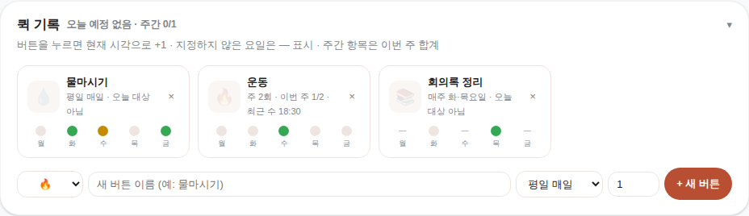

| 핵심 파일·심볼 | 역할 |
|---|---|
| `index.html` `loadHabits()` / `quick.js` `loadQk()` | 같은 API를 두 곳에서 그립니다. 모달에서 누르면 카드도 갱신(`loadHabits` 존재 시) |
| `index.ts` `habitCanTapOn(button, date)` | 오늘 눌러도 되는 버튼인지: 주말 불가, `daily`/`weekly`는 평일 항상, `selected`는 `repeat_days`(ISO 1~5)에 포함될 때 |
| `index.ts` `POST /api/habits/:id/tap` | `habit_records`(날짜별 count UPSERT)와 `habit_taps`(누른 시각)를 **한 batch**로 저장 |

| 단계·담당 함수 | 받는 값 | 처리·조건 | 반환값·부수 효과 | 화면 |
|---|---|---|---|---|
| F1 `habitForm` submit | `name`, `emoji`(선택지 또는 직접 입력, 8자), `repeat_type`, `repeat_days[]`, `goal` | `POST /api/habits`. `selected`인데 요일이 없으면 400. `daily`는 `repeat_days='1,2,3,4,5'`, `weekly`는 빈 문자열 | `{ok}` | 카드 추가 |
| F2 `loadHabits()` | 이번 주 월~금 | `GET /api/habits?from&to` → `buttons`, `records`, `taps` | 버튼별 오늘/이번 주 진행, 누른 시각 목록 | 점 색: 목표 달성 초록, 일부 노랑, 없음 회색 |
| F3 `tapHabit(id)` | 버튼 id | `POST /api/habits/:id/tap {date?}`. `habitCanTapOn` 실패 시 400 "오늘 기록하는 항목이 아닙니다" | `{date, time}` | F2 |
| F4 `rmHabit(id)` | 버튼 id | `DELETE /api/habits/:id` → `active=0` (기록 보존) | `{ok}` | F2 |

- 캡처가 토요일이라 모든 버튼이 비활성입니다. 평일에는 `due`인 버튼만 활성입니다.
- 카카오 공유 버튼은 `/api/config`의 `kakao_js_key`가 있을 때만 Kakao SDK를 불러오고, 없으면 `navigator.share` 또는 클립보드로 대체합니다.

#### S01-F 리마인드 알림 연결 — 카카오·구글 토큰 상태와 테스트 발송

| 단계·담당 함수 | 받는 값 | 처리·조건 | 반환값·부수 효과 | 화면 |
|---|---|---|---|---|
| F1 `loadReminderStatus()` | 없음 | `GET /api/reminders/status` → `oauth_tokens`에서 내 `kakao`/`google` 갱신 시각, 시크릿 등록 여부 | `{kakao, google, secrets_ready, google_ready}` | "카카오 ✅ · 캘린더 미연결" 등 |
| F2 [카카오 연결]/[구글 캘린더 연결] | 링크 이동 | `/auth/kakao/start`, `/auth/google/start` (S09-B) | 리다이렉트 | 돌아오면 `?connected=`를 지움 |
| F3 [테스트 발송] | 없음 | `POST /api/reminders/test {when?, profile?}` → 저녁 점검 문구 조립 후 카카오 발송 | `{sent, detail, text}` | alert |

#### S01-G 체크리스트(⑤) — 항목 체크와 항목별 메모

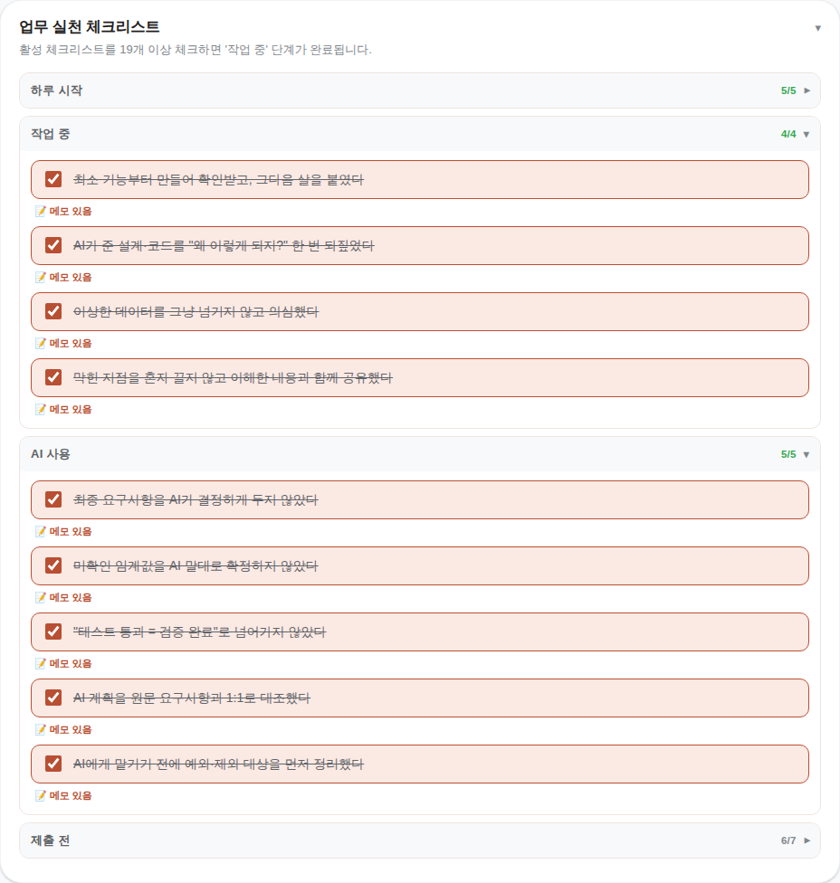

| 핵심 파일·심볼 | 역할 |
|---|---|
| `index.html` `loadChecklist()` / `nowSections()` | 섹션별 2중 아코디언. **지금 시각 구간**만 펼칩니다: 12:30 전 `하루 시작`, 17:00 전 `작업 중`·`AI 사용`, 그 뒤 `제출 전` |
| `index.ts` `GET /api/checklist` | 활성 항목 + 내 오늘 체크 여부 + 내 오늘 메모 |
| `index.ts` `POST /api/checks` | 체크 INSERT(중복 무시) / 해제 DELETE |
| `index.ts` `PUT /api/checklist/:itemId/memo` | 메모 UPSERT. 빈 문자열이면 삭제. 체크 해제와 무관하게 보존 |
| `seed/seed.sql`, `migrations/0009` | 항목 문구의 출처. **문구를 임의로 바꾸지 않습니다** (대표 피드백에서 도출) |

| 단계 | 받는 값 | 처리·조건 | 반환·부수 효과 | 화면 |
|---|---|---|---|---|
| F1 `loadChecklist()` | 없음 | `GET /api/checklist` → `items[{id, section, text, sort, checked, memo, memo_updated_at}]` | 섹션 DOM, `accSections()`로 접힘 상태 복원 | ⑧ |
| F2 체크박스 | `item_id, checked` | `POST /api/checks {item_id, checked, date?}` | `checks` 1행 추가/삭제 | 배지 재계산(`refreshSecCounts`), 보드 갱신, 메모칸 열림 |
| F3 메모 입력 | `memo`(1000자) | 700ms 디바운스 후 `PUT …/memo`. 날짜 형식 검사, 활성 항목 아니면 404. 저장 중 값이 바뀌면 재큐 | `{memo, deleted}` | "저장됨"/"메모 삭제됨", 📝 힌트 |

- 항목을 추가·비활성화하려면 DB에서 `checklist_items` 행을 직접 다룹니다(`active=0`). `seed.sql`을 운영 DB에 다시 돌리면 맨 위 `DELETE`로 기록이 날아갑니다.

#### S01-H 검증 기록(②) — "원본과 대조해 확인함"을 표로 남기기

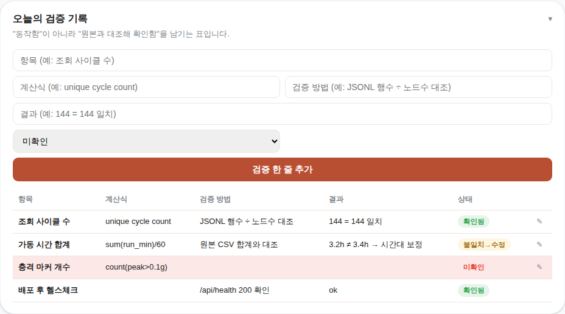

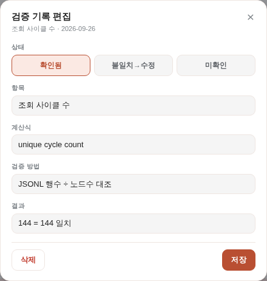

| 단계 | 받는 값 | 처리·조건 | 반환·부수 효과 | 화면 |
|---|---|---|---|---|
| F1 `vform` submit | `item`(필수), `formula`, `method`, `result`, `status` | `POST /api/verifications`. 상태는 `V_STATUS`(`확인됨`, `불일치→수정`, `미확인`) 아니면 `미확인` | `verifications` INSERT | 표 갱신, 보드 `verify` 완료 |
| F2 `loadVerifs()` | 오늘 | `GET /api/verifications?date=` — **팀 전체** 오늘 행 | `rows[]` | 내 행만 `editable` |
| F3 행 클릭 → `openVerifModal` | 행 | `PATCH /api/verifications/:id` 본인만(404). 항목 비우면 400 | `{ok}` | F2 + 보드 |
| F4 모달 [삭제] | id | `DELETE /api/verifications/:id` 본인만 | `{deleted}` | F2 |

- 같은 모달을 S05 대시보드가 재사용합니다. 필드를 추가하면 `verifications` 스키마, `POST`·`PATCH` 두 라우트, `edit.js` 모달, `dashboard.html` 표 열, 주간보고의 `검증:` 문장 조립(`report.ts`)을 함께 봅니다.

### S02 스케줄 `/schedule` — 도넛 달력으로 6주 습관을 보고, 주간·월간 일정을 관리하기

위 카드는 최근 6주(주중 5열)의 **사이클 완료 이력**을 도넛으로, 아래 카드는 주간(월~일) 또는 월간 달력을 보여줍니다. 주간 뷰의 일정 태그·등록 폼·편집 모달은 S01-B와 같은 코드입니다.

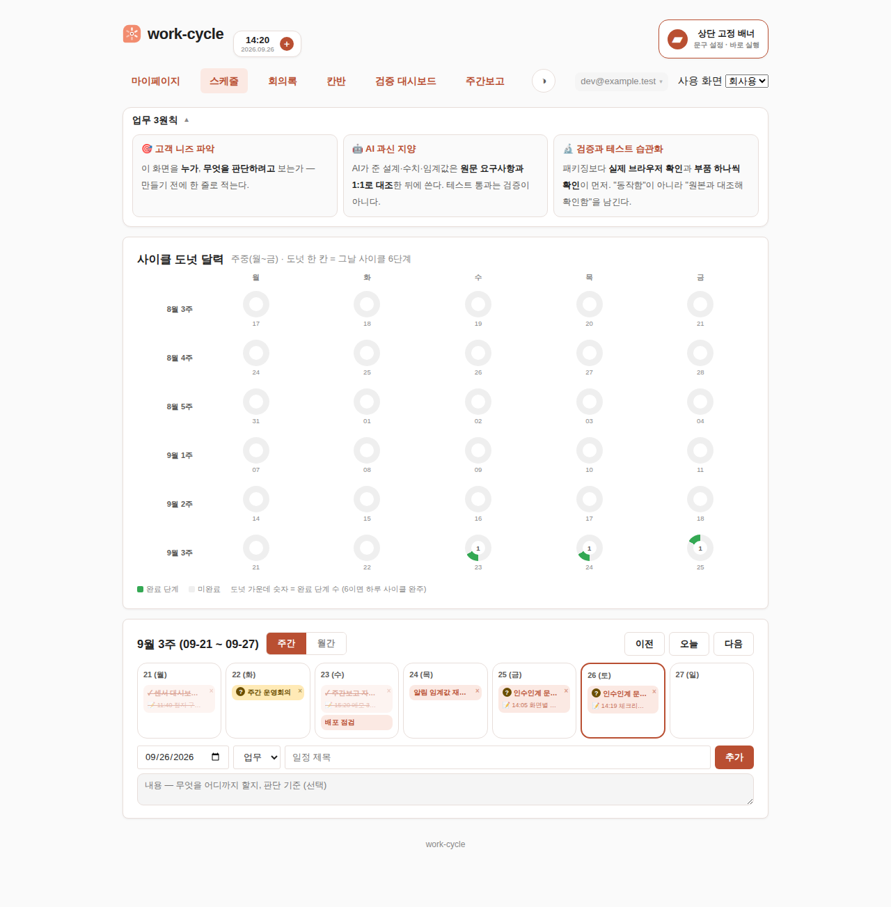

모바일: [`assets/pages/S02-schedule-week-mobile.png`](assets/pages/S02-schedule-week-mobile.png). 월간 뷰 전체: [`assets/pages/S02-schedule-month-desktop.png`](assets/pages/S02-schedule-month-desktop.png)

| 번호·영역 | 무엇을 보여주나 | 연결 코드·데이터 |
|---|---|---|
| ① 도넛 달력 | 주 6행 × 월~금. 도넛 한 칸 = 그날 6단계(60도씩), 가운데 숫자 = 완료 수, 오늘은 테두리, 미래는 흐림 | `loadDonuts()` → `GET /api/cycle_history` |
| ② 도넛 툴팁 | 단계별 완료/미완료. 클릭하면 그 주 주간 뷰로 이동 | `showTip()`, `#dTip` |
| ③ 주간/월간 토글 · 이전/오늘/다음 | `VIEW`, `ANCHOR`(주간=월요일 Date, 월간=`YYYY-MM`) | `setView()`, `move()` |
| ④ 주간 뷰 | S01-B와 동일 | `loadWeek()`, `openSchedModal` |
| ⑤ 월간 뷰 | 일정(파랑)·회의(노랑)·사이클 기록(초록 `c체크수·v검증수·r`) | `loadMonth()` → `GET /api/month` |

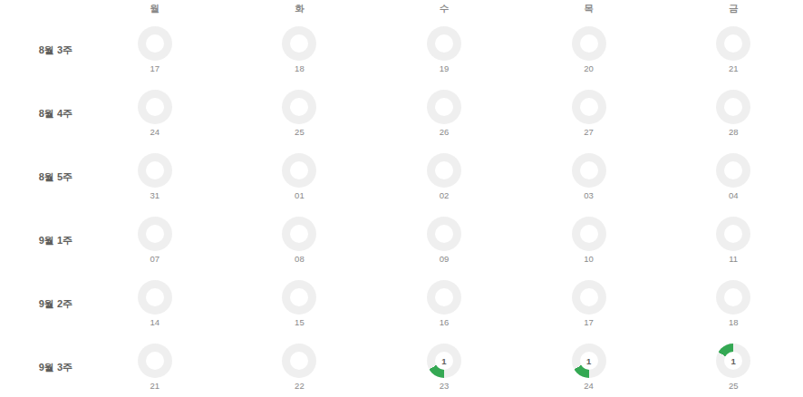

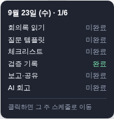

| 핵심 파일·심볼 | 역할 |
|---|---|
| `schedule.html` `loadDonuts()` | 이번 주 월요일 기준 5주 전 월요일부터 이번 주 금요일까지 조회해 `conic-gradient`로 도넛을 그립니다 |
| `index.ts` `GET /api/cycle_history` | 기간 내 **현재 사용자**의 날짜별 6단계 완료 여부. 보드와 같은 규칙(체크 19개 이상) |
| `index.ts` `meetingReadCycleDate()` | 회의록 날짜 → 어느 업무일의 `read`로 셀지 (금·토 회의록은 월요일) |
| `index.ts` `GET /api/month` | 월간: 팀 전체 일정·회의록 + 내 검증·체크·회고 날짜 |

| 단계·담당 함수 | 받는 값 | 처리·조건 | 반환값·부수 효과 | 화면 |
|---|---|---|---|---|
| F1 `loadDonuts()` | `from`(5주 전 월), `to`(이번 주 금) | `GET /api/cycle_history?from&to` | `days[{date, steps, done}]` → `DONUT_DATA` | ① |
| F2 `/api/cycle_history` | `from, to, email` | 6개 쿼리 병렬: `checks`(HAVING distinct ≥ 19), `verifications`, `step_marks`, `meeting_reads`(회의록 날짜를 `meetingReadCycleDate`로 변환해 기간 안이면 반영), `ai_requests`, `retros` | `{from, to, step_meta, days}` — 기록이 하나도 없는 날은 배열에 없음 | 화면은 없는 날을 0/6으로 표시 |
| F3 `showTip(btn)` | `data-date` | `DONUT_DATA[date]`에서 단계별 문구. 위 공간이 좁으면 아래로 배치 | 없음(툴팁 DOM) | ② |
| F4 도넛 클릭 | `data-date` (미래 제외) | `ANCHOR = mondayOf(date)`, 주간 뷰로 전환, `loadWeek()` 후 스크롤 | 없음 | ④ |
| F5 `loadMonth()` | `ANCHOR` `YYYY-MM` | `GET /api/month?ym=` → 날짜별로 묶어 42칸 이하 격자 | 없음 | ⑤ |

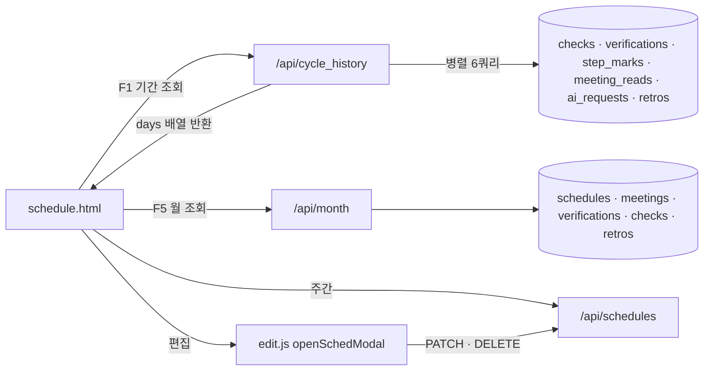
```mermaid
flowchart LR
  A[schedule.html] -->|F1 기간 조회| B["/api/cycle_history"]
  B -->|병렬 6쿼리| D[(checks · verifications · step_marks · meeting_reads · ai_requests · retros)]
  B -->|days 배열 반환| A
  A -->|F5 월 조회| C["/api/month"]
  C --> E[(schedules · meetings · verifications · checks · retros)]
  A -->|주간| F["/api/schedules"]
  A -->|편집| G[edit.js openSchedModal]
  G -->|PATCH · DELETE| F
```

| API·저장 연결 | 실제 내용 |
|---|---|
| 읽기 | 도넛: 위 6개 테이블(내 것만). 월간: `schedules`(팀, 나간 계정 제외), `meetings`, 내 `verifications`/`checks`/`retros` |
| 쓰기 | 주간 뷰의 일정 등록·수정·삭제만 (S01-B와 같은 라우트) |
| 수정 위치·영향 | 도넛 주 수를 바꾸려면 `loadDonuts()`의 `7*5`와 행 반복 `w<6` 둘 다. 단계 색은 CSS 변수 `--donut-done`, `--donut-todo` |
| 수정 후 확인 | 오늘 검증 1건 추가 → 도넛 오늘 칸 숫자 +1, 툴팁 "검증 기록 완료". `/api/board`와 값 일치 |

---

### S03 회의록 `/meetings` — 회의 중 메모, AI 회의록 생성, 회의록 목록·옵시디언 가져오기

세 개의 하위 탭이 있습니다. 기본 탭은 **회의 중 메모**이고, `?tab=list`로 들어오면 목록 탭이 열립니다(S01 사이클 보드의 회의록 읽기 카드에서 이동).

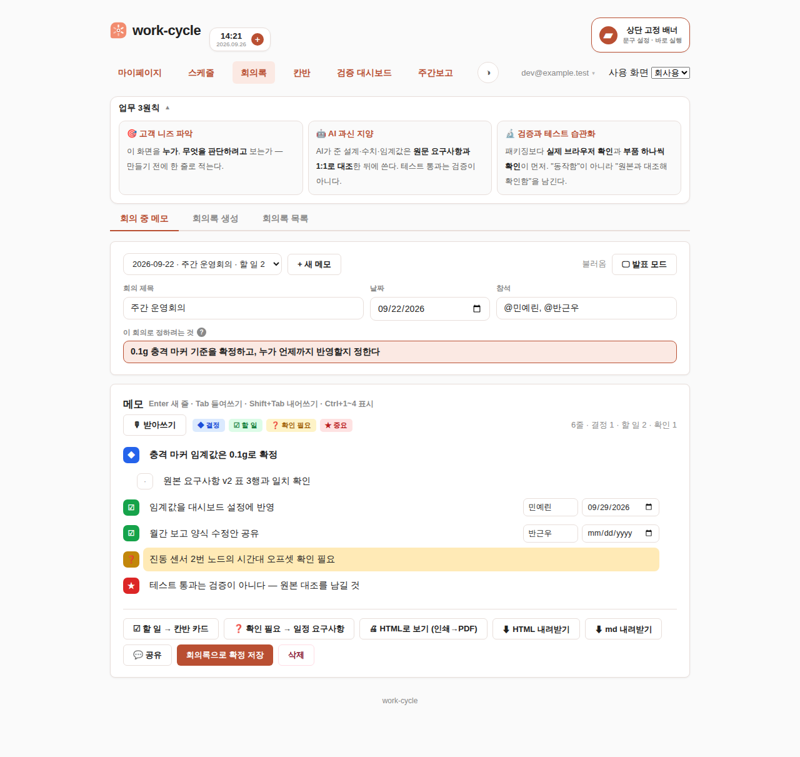

모바일: [`assets/pages/S03-meetings-live-mobile.png`](assets/pages/S03-meetings-live-mobile.png)

#### S03-A 회의 중 메모 — 트리형 아웃라이너와 자동 저장

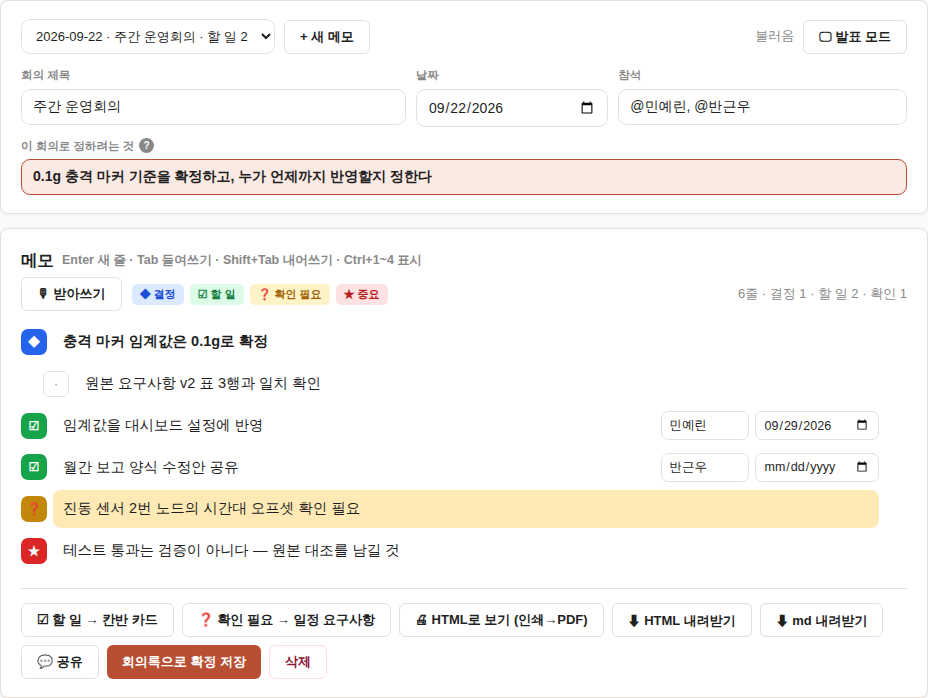

| 번호·영역 | 무엇을 보여주나 | 연결 코드·데이터 |
|---|---|---|
| ① 메모 선택·새 메모·저장 상태·발표 모드 | 내 메모 목록(할 일 수, ✓확정 표시) | `loadNoteList()` → `GET /api/notes` |
| ② 제목·날짜·참석·이 회의로 정하려는 것 | `purpose`는 산출물 맨 위에 고정 | `meeting_notes.title/date/attendees/purpose` |
| ③ 아웃라인 | 줄마다 들여쓰기(`d` 0~5), 마크(`m`), 본문(`t`), 할 일이면 담당(`who`)·기한(`due`) | `NODES[{d,m,t,who,due}]`, `meeting_notes.outline` JSON |
| ④ 액션 | 할 일→칸반, 확인 필요→일정 요구사항, HTML/md 내보내기, 공유, 회의록으로 확정, 삭제 | 아래 F6~F10 |

| 핵심 파일·심볼 | 역할 |
|---|---|
| `meetings.html` `rowEl()`, `nodesFromDom()` | 한 줄 DOM ↔ 노드 객체 변환. 키보드: Enter 새 줄, Tab/Shift+Tab 들여쓰기(앞 줄+1까지), Ctrl+1~4 마크, 빈 줄 Backspace 삭제 |
| `meetings.html` `queueSave()` / `saveNote()` | 입력마다 1.2초 디바운스. 첫 저장은 `POST /api/notes`, 이후 `PUT /api/notes/:id` |
| `index.ts` `cleanOutline(v)` | 서버 정규화: 최대 500줄, `d` 0~5, `m`은 `''|star|decide|todo|need`, `t` 1000자, `who` 60자, `due`는 `YYYY-MM-DD`만 |
| `index.ts` `/api/notes/*` | 목록·단건·저장·수정·삭제·칸반·내보내기·확정 |
| `src/notedoc.ts` `noteToMd()`, `noteToHtml()` | 산출물 고정 포맷. 제목 아래 **"이 회의로 정하려는 것"**이 항상 오고, 비면 안내 문구가 대신 찍힘 |

| 단계·담당 함수 | 받는 값 | 처리·조건 | 반환값·부수 효과 | 화면 또는 다음 소비자 |
|---|---|---|---|---|
| F1 `lvBoot()` | `?schedule_id&title&date`(선택) | 목록 로드 후 `newNote()`. 일정에서 넘어왔으면 제목·날짜 채움 | 없음 | ①② |
| F2 입력 → `queueSave()` | DOM | 1.2초 뒤 `saveNote()` | "입력 중…" → "저장됨 HH:MM" | ① |
| F3 `saveNote()` | 제목·날짜·참석·목적·`NODES` | `NOTE` 없으면 `POST` → id 받아 목록 갱신; 있으면 `PUT`(본인 것만 404) | `meeting_notes` 1행 | `countUp()` 줄·결정·할 일·확인 수 |
| F4 `cleanOutline` (서버) | `outline` 배열 | 위 상한으로 자르고 잘못된 값은 기본값 | 정규화된 배열 → JSON 문자열 저장 | — |
| F5 `lvPick` change | 메모 id | `GET /api/notes/:id` → `render(outline)` | 화면 채움, "회의록으로 확정된 메모" 표시 | ②③ |
| F6 [☑ 할 일 → 칸반 카드] | 저장된 id | 화면에서 `todo` 줄이 없으면 서버 호출 없이 안내. 있으면 `POST /api/notes/:id/kanban`: `[담당] 본문`, 기한 있으면 `즉시처리`·빨강, 없으면 `전략적계획`·파랑 (최대 30) | `{created}` → `kanban_cards` | alert |
| F7 [❓ 확인 필요 → 일정 요구사항] | 회의 날짜 | 그날 **내 일정** 조회 → 메모의 `schedule_id`, 일정 1개면 그것, 여럿이면 `prompt`로 번호 선택 → `PATCH /api/schedules/:id {confirm_line: 기존+새 줄}` | `schedules.confirm_line` | alert 후 S01-B 모달에서 확인 요청 |
| F8 [HTML로 보기]/[HTML 내려받기]/[md 내려받기] | id | `GET /api/notes/:id/export?fmt=html&inline=1` 새 탭(인쇄→PDF), `fmt=html`/`fmt=md`는 `Content-Disposition: attachment` | 파일 | 브라우저 |
| F9 [회의록으로 확정 저장] | id | `POST /api/notes/:id/publish`: `noteToMd`로 본문 생성. `meeting_id` 있으면 `meetings` UPDATE, 없으면 INSERT(`body_mode='full'`) 후 메모에 `meeting_id` 기록 | `{meeting_id, updated}` | 목록 탭에 나타남 |
| F10 [삭제] | id | `DELETE /api/notes/:id` — 확정한 회의록은 남음 | `{deleted}` | `newNote()` |

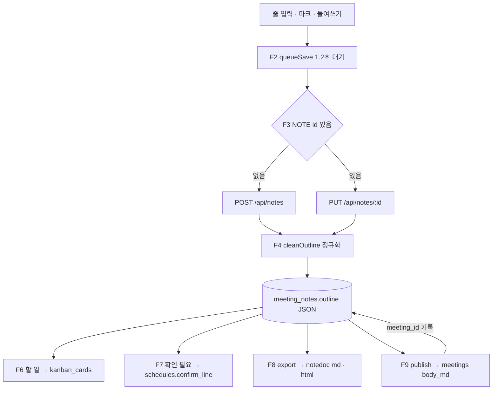
```mermaid
flowchart TD
  I[줄 입력 · 마크 · 들여쓰기] --> Q[F2 queueSave 1.2초 대기]
  Q --> S{F3 NOTE id 있음}
  S -->|없음| P[POST /api/notes]
  S -->|있음| U[PUT /api/notes/:id]
  P --> C[F4 cleanOutline 정규화]
  U --> C
  C --> DB[(meeting_notes.outline JSON)]
  DB --> K[F6 할 일 → kanban_cards]
  DB --> N[F7 확인 필요 → schedules.confirm_line]
  DB --> X[F8 export → notedoc md · html]
  DB --> M[F9 publish → meetings body_md]
  M -->|meeting_id 기록| DB
```

| API·저장 연결 | 실제 내용 |
|---|---|
| 읽기·쓰기 | `meeting_notes(id, user_email, date, title, purpose, attendees, outline JSON, meeting_id, schedule_id, created_at, updated_at)`. 목록의 `todos` 수는 SQLite `json_each`로 셉니다 |
| 산출물 | `noteToMd`: 제목 → 목적 인용 → 날짜·참석 표 → 결정된 것 → 할 일 표(+체크박스) → 확인이 필요한 것 → 중요 표시 → 메모 전문. `noteToHtml`은 같은 구조의 인쇄용 HTML |
| 수정 위치·영향 | 마크를 추가하면 `MARKS`(서버), `MK`/`MK_IC`/`MK_NM`(화면), `notedoc.ts`의 `MARK_LABEL`/`MARK_ICON`과 섹션, CSS `.m-*`를 함께. **목적 고정 문구는 지우지 않습니다** (HANDOFF 3-3) |
| 수정 후 확인 | 할 일 2줄(기한 1개) → 칸반 카드 2장, 사분면 즉시처리 1·전략적계획 1. `?fmt=md` 첫 줄이 `# 제목`, 셋째 줄이 목적 |

#### S03-B 회의록 생성 — 녹음·자막 텍스트를 AI로 요약해 저장

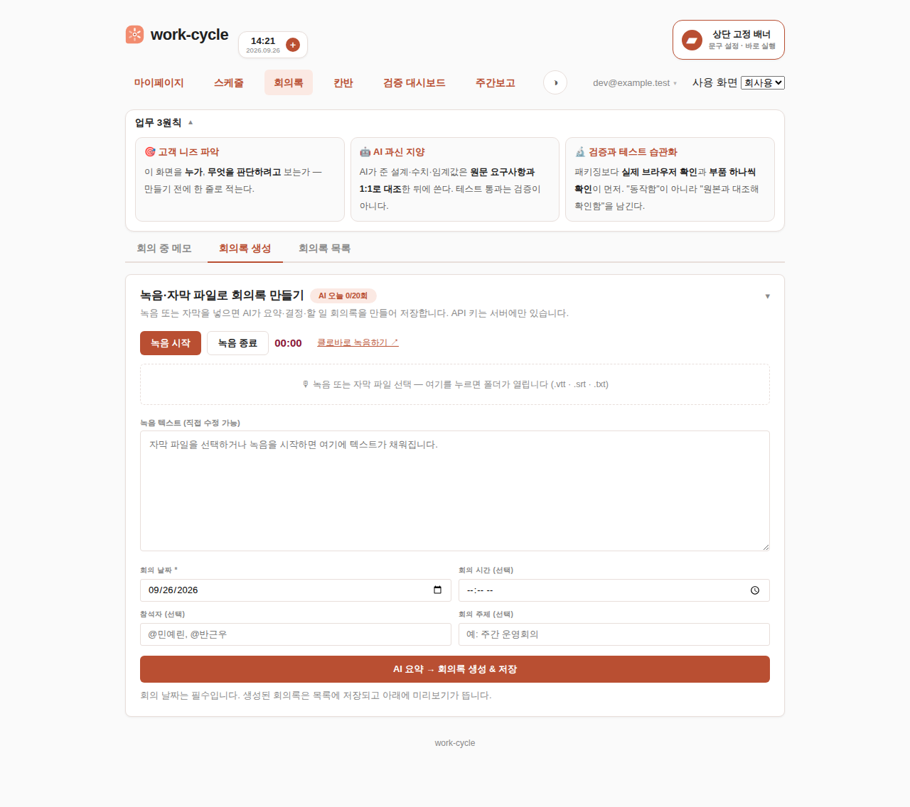

| 단계·담당 함수 | 받는 값 | 처리·조건 | 반환값·부수 효과 | 화면 |
|---|---|---|---|---|
| F1 녹음 / 자막 파일 | Web Speech API(Chrome) 또는 `.vtt/.srt/.txt` | 자막은 타임코드·번호·`WEBVTT` 줄 제거 후 `#transcript`에 채움 | 없음 | 텍스트 영역 |
| F2 `loadUsage()` | 없음 | `GET /api/ai/usage` → 오늘 호출 수 / 한도 20 / AI 설정 여부 | `{calls, limit, ready}` | "AI 오늘 n/20회" |
| F3 [AI 요약 → 회의록 생성 & 저장] | `date`(필수), `transcript`(필수), `time`, `attendees`, `topic`, `schedule_id` | `POST /api/meetings/summarize`: AI 미설정 400, 한도 초과 429, 프롬프트에 고정 섹션 구조 지시. `GEMINI_API_KEY='dev-mock'`이면 모의 응답 | `meetings` INSERT(`body_mode='full_md'`, `body_md`), `ai_usage` +1 | 미리보기 카드, 사용량 갱신 |
| F4 `generateAiText()` | `prompt, maxTokens` | **Workers AI 먼저**(`env.AI`, gemma). 빈 응답·예외면 `GEMINI_API_KEY`로 Gemini(`GEMINI_MODEL` 기본 `gemini-3.6-flash`). 둘 다 실패면 오류 문자열을 합쳐 throw | `{text, provider}` | 502 `AI 요약 실패: <원문 앞 400자>` |
| F5 결과 액션 | `LAST.id` | md 내려받기(브라우저 Blob), 복사, `POST /api/meetings/:id/kanban`(`- [ ]` 줄 → 카드, `priority:High`면 즉시처리), `POST /api/meetings/:id/issue`(S03-C) | — | alert / 새 탭 |

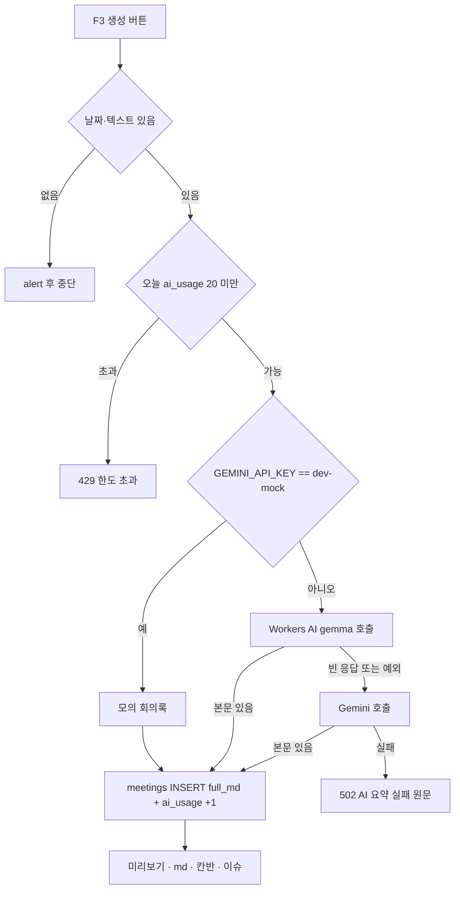
```mermaid
flowchart TD
  G[F3 생성 버튼] --> V{날짜·텍스트 있음}
  V -->|없음| A1[alert 후 중단]
  V -->|있음| L{오늘 ai_usage 20 미만}
  L -->|초과| E429[429 한도 초과]
  L -->|가능| MK{GEMINI_API_KEY == dev-mock}
  MK -->|예| MOCK[모의 회의록]
  MK -->|아니오| WA[Workers AI gemma 호출]
  WA -->|본문 있음| SAVE
  WA -->|빈 응답 또는 예외| GM[Gemini 호출]
  GM -->|본문 있음| SAVE[meetings INSERT full_md + ai_usage +1]
  GM -->|실패| E502[502 AI 요약 실패 원문]
  MOCK --> SAVE
  SAVE --> R[미리보기 · md · 칸반 · 이슈]
```

- 프롬프트 상 회의 텍스트는 60,000자에서 잘립니다. 화면 저장 전에는 서버 PDF를 만들지 않습니다(Workers에서 무거움).
- 한도 `AI_DAILY_LIMIT=20`은 사용자·날짜 단위이며 S06 문장 다듬기와 **같은 카운터**를 씁니다.

#### S03-C 회의록 목록 — 옵시디언 볼트 가져오기, 읽음 처리, 이슈 생성

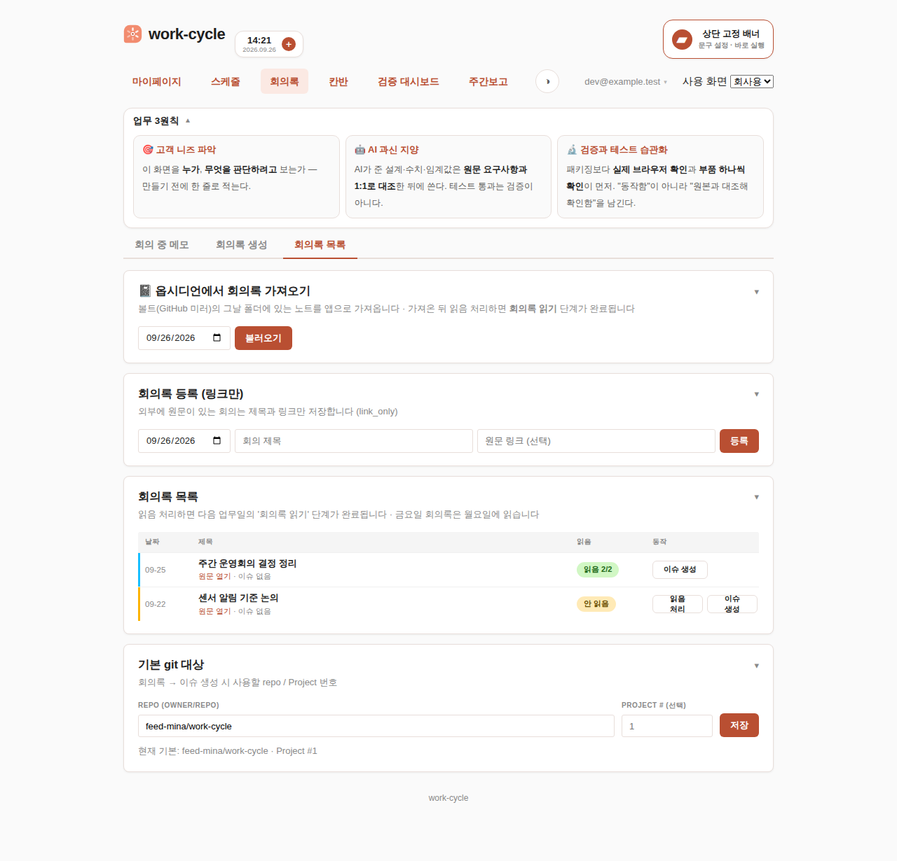

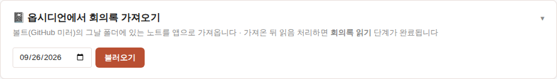

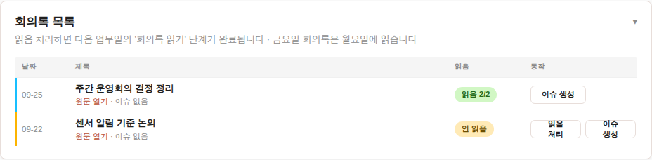

| 핵심 파일·심볼 | 역할 |
|---|---|
| `index.ts` `vaultDayPath(dir, date)` | 볼트 폴더 규칙 `daily/9월/9월25일` (월은 0 없이, 일은 두 자리) |
| `index.ts` `ghVaultFetch()` / `vaultGithubToken()` | GitHub Contents API 호출. `GITHUB_TOKEN_VAULT` 우선, 없으면 `GITHUB_TOKEN` |
| `index.ts` `vaultPathOk()` | `VAULT_DIR/`로 시작하고 `.md`이며 `..`이 없는 경로만 허용 |
| `src/vault-reader.ts` `vaultMarkdownToHtml()` | 프런트매터 분리, 위키링크·첨부 무해화, 코드블록·표·콜아웃을 안전한 HTML로. 링크는 http(s)만 |
| `index.ts` `GET /api/meetings`, `POST /api/meetings/:id/read` | 목록(읽음 수·내 읽음 여부)과 읽음 기록 |
| `index.ts` `POST /api/meetings/:id/issue` | 기본 git 대상 레포에 이슈 생성, `gh_issue_url` 저장 |

| 단계·담당 함수 | 받는 값 | 처리·조건 | 반환값·부수 효과 | 화면 |
|---|---|---|---|---|
| F1 `loadVault()` | `vDate` | `GET /api/vault/notes?date=`. 토큰 없음 400, 폴더 없음(404)은 빈 목록 + 안내, 그 외 실패는 `볼트 조회 실패 (status) 원문 300자` 502. 이미 가져온 파일은 `meetings.link`(볼트 경로)로 `imported` 표시 | `{date, path, rows[{name, path, size, title, imported}]}` | 파일 목록 |
| F2 [가져오기] | `path, date` | `POST /api/vault/import`: 경로 검사 → 같은 `link` 있으면 `already` → base64를 바이트 단위로 디코드(한글 보존) → `meetings` INSERT(`body_mode='full_md'`, `body_md` 20만 자, `link`=경로) | `{id, title, chars}` | alert, 목록 갱신 |
| F3 `loadMeetings()` | 없음 | `GET /api/meetings` 최근 100건 + `team_size`(나간 계정 제외) | `rows[]`, `read_count`, `read_by_me` | 행 표시. `full_md`의 `link`가 URL이 아니면 [원문 열기]가 `/api/vault/file?path=`로 감 |
| F4 [원문 열기] | `path` | `GET /api/vault/file?path=`: 볼트에서 다시 읽어 `vaultMarkdownToHtml`. `raw=1`이면 text/plain. CSP·noindex 헤더 | HTML 응답 | 새 탭 읽기 모드 |
| F5 [읽음 처리] | id | `POST /api/meetings/:id/read` → `meeting_reads` (UNIQUE) | `{ok}` | 보드 `read` 완료(해당 업무일) |
| F6 [이슈 생성] | id | `POST /api/meetings/:id/issue`: `GITHUB_TOKEN` 없음 400, 이미 있으면 기존 URL, 기본 git 대상 없음 400, 본문은 `body_md` 앞 6000자 또는 링크 | `{url}` → `meetings.gh_issue_url` | 새 탭 |
| F7 링크만 등록 / 기본 git 대상 | `date, title, link` / `repo, project_no` | `POST /api/meetings`(`link_only`), `POST /api/git_targets`(기존 기본 해제 후 새 행) | — | 목록·현재 기본 표시 |

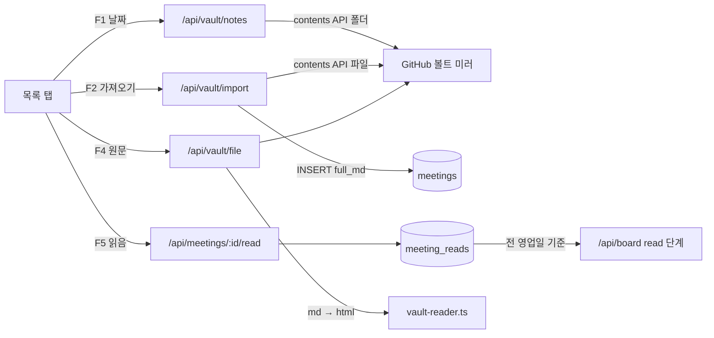
```mermaid
flowchart LR
  L[목록 탭] -->|F1 날짜| VN["/api/vault/notes"]
  VN -->|contents API 폴더| GH[GitHub 볼트 미러]
  L -->|F2 가져오기| VI["/api/vault/import"]
  VI -->|contents API 파일| GH
  VI -->|INSERT full_md| M[(meetings)]
  L -->|F5 읽음| RD["/api/meetings/:id/read"]
  RD --> MR[(meeting_reads)]
  MR -->|전 영업일 기준| B["/api/board read 단계"]
  L -->|F4 원문| VF["/api/vault/file"]
  VF --> GH
  VF -->|md → html| VR[vault-reader.ts]
```

| API·저장 연결 | 실제 내용 |
|---|---|
| `meetings.body_mode` 실제 값 | 스키마 주석은 `link_only | full`이지만 코드는 세 가지를 씁니다: 링크 등록 `link_only`, AI 생성·볼트 가져오기 `full_md`, 메모 확정 `full`. 화면은 `full_md`일 때만 `link`를 볼트 경로로 해석합니다 |
| 환경 변수 | `VAULT_REPO`(기본 `feed-mina/ME`), `VAULT_DIR`(기본 `daily`), `GITHUB_TOKEN_VAULT`, `GITHUB_TOKEN` |
| 수정 위치·영향 | 볼트 폴더 규칙이 바뀌면 `vaultDayPath()`만. 회의록을 다른 날의 `read`로 세는 규칙은 `meetingReadSourceDate`(보드·알림)와 `meetingReadCycleDate`(도넛) **두 함수가 짝**입니다 |
| 수정 후 확인 | 금요일 회의록을 읽음 처리 → 월요일 보드 `read` 완료, 도넛의 월요일 칸 반영. 토큰 없이 볼트 조회 → 400 문구가 화면에 그대로 |

---

### S04 칸반 `/kanban` — 우선순위 4사분면과 GitHub 이슈 카드

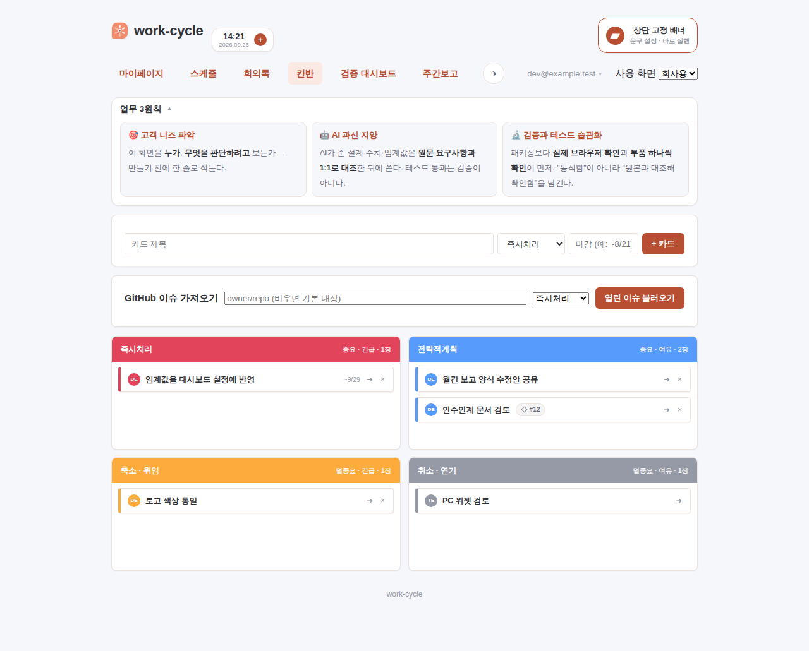

모바일: [`assets/pages/S04-kanban-mobile.png`](assets/pages/S04-kanban-mobile.png) — 사분면이 1열로 쌓입니다.

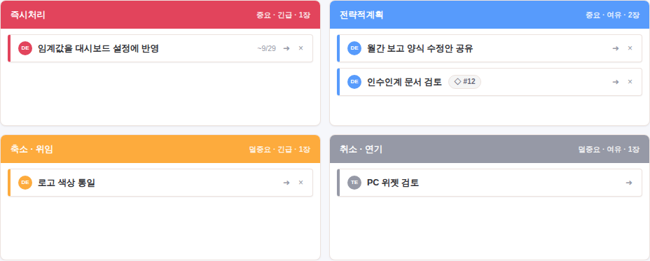

| 핵심 파일·심볼 | 역할 |
|---|---|
| `kanban.html` `load()` | `GET /api/kanban` 결과를 `quads` 순서(즉시처리·전략적계획·축소위임·취소연기)로 그립니다. 즉시처리 카드가 3장을 넘으면 경고 카드 표시 |
| `kanban.html` `QMETA`, `NEXT` | 사분면별 부제·색, ➜ 버튼의 다음 사분면 순환 |
| `index.ts` `QUADS`, `/api/kanban*` | 사분면 화이트리스트, 등록·이동·삭제 |
| `index.ts` `GET /api/github/issues` | 열린 이슈 30개(PR 제외). 이미 카드가 있는 번호는 `linked` |

| 단계·담당 함수 | 받는 값 | 처리·조건 | 반환값·부수 효과 | 화면 |
|---|---|---|---|---|
| F1 `kForm` submit | `title`, `quadrant`, `due`(자유 텍스트), `color`(화면이 사분면 색으로 채움) | `POST /api/kanban`. 제목·사분면 검사. 이슈 연결 시 `gh_repo`(owner/repo)와 `gh_issue_no` 둘 다 필요 | `kanban_cards` INSERT | F2 |
| F2 `load()` | 없음 | `GET /api/kanban` → 팀 전체 카드(나간 계정 제외) + 작성자 이름 | `{rows, quads}` | 사분면, 경고 |
| F3 ➜ `moveCard()` | id, 다음 사분면 | `PATCH /api/kanban/:id {quadrant}` — **소유자 확인 없음** (팀 누구나 이동 가능) | `{ok}` | F2 |
| F4 × `rmCard()` | id | `DELETE /api/kanban/:id` — 본인 카드만 | `{deleted}` | F2 |
| F5 [열린 이슈 불러오기] | `repo`(비우면 기본 git 대상) | `GET /api/github/issues?repo=`: 토큰 없음 400, 형식 오류 400, GitHub 실패 502 | `{repo, issues[{number,title,url,linked}]}` | 표 |
| F6 [+ 카드] (이슈) | 표의 제목, 선택 사분면 | F1과 같은 `POST`에 `gh_repo, gh_issue_no, gh_state:'open'` | 카드 + ◇ 배지 | F2, F5 |

| API·저장 연결 | 실제 내용 |
|---|---|
| 읽기·쓰기 | `kanban_cards(id, user_email, quadrant, title, gh_issue_url, sort, due, color, gh_repo, gh_issue_no, gh_state)`. `sort`는 항상 0(정렬 UI 없음), `gh_state`는 저장만 하고 갱신하지 않음 |
| 다른 화면에서 들어오는 카드 | S03-A 메모 할 일(`[담당] 제목`, 기한→즉시처리), S03-B AI 회의록의 `- [ ]` 줄, S06 주간 목표 자동값(즉시처리+전략적계획 제목 최대 8개 읽기) |
| 수정 위치·영향 | 사분면 이름은 `QUADS`(서버), `QMETA`/`NEXT`/폼 `<option>`(화면), `report.ts`의 `quadrant IN (...)` 조건까지 4곳 |
| 수정 후 확인 | 카드 4장 → 사분면 수 일치, 즉시처리 4장이면 경고 카드 표시, 다른 이메일로 DELETE 시 `deleted:0` |

---

### S05 검증 대시보드 `/dashboard` — 팀 검증 기록 이력 (대표 공유용)

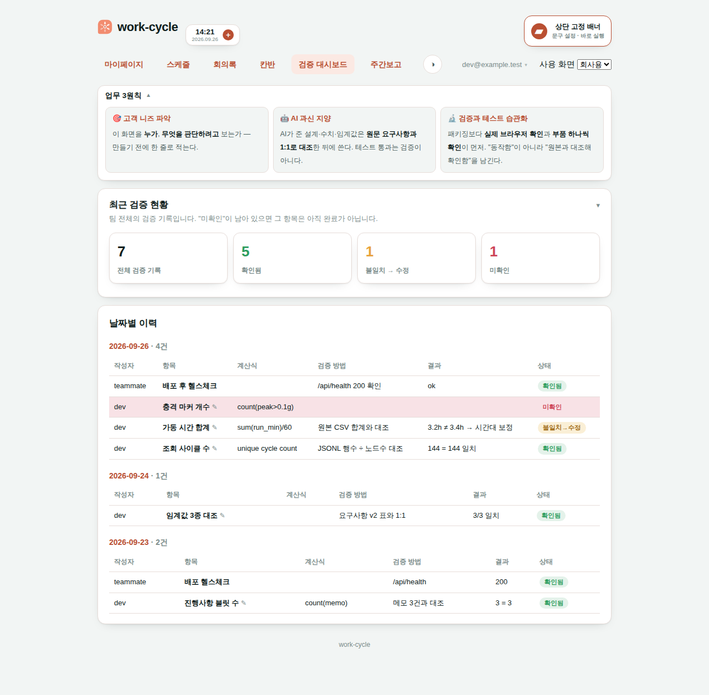

모바일: [`assets/pages/S05-dashboard-mobile.png`](assets/pages/S05-dashboard-mobile.png) — 표는 가로 스크롤(`.tbl-scroll`).

| 단계·담당 함수 | 받는 값 | 처리·조건 | 반환값·부수 효과 | 화면 |
|---|---|---|---|---|
| F1 `loadDash()` | `days=21` | `GET /api/dashboard?days=`: 최근 500행(나간 계정 제외)을 날짜별로 묶고 **기록이 있는 날짜** 최근 21개(최대 60)만. 요약은 그 범위의 상태별 수 | `{dates[{date, rows}], summary{total, 확인됨, 불일치→수정, 미확인}}` | ① 타일, ② 날짜별 표 |
| F2 내 행 클릭 | 행 | `openVerifModal(row, loadDash)` (S01-H와 동일 모달) | `PATCH/DELETE /api/verifications/:id` | F1 |

| API·저장 연결 | 실제 내용 |
|---|---|
| 읽기 | `verifications ⋈ users(name)`. 이 화면 전용 쓰기는 없음 |
| 화면 규칙 | `미확인` 행은 `todo-row` 강조. "미확인이 남아 있으면 완료가 아니다"는 문구가 3원칙 ③의 화면 표현 |
| 수정 위치·영향 | 기간을 바꾸려면 `dashboard.html`의 `?days=21`과 서버 상한 60. 500행 제한은 `LIMIT 500` |
| 수정 후 확인 | 상태 3종 각 1건 추가 → 타일 1/1/1, 합계 3. 편집 모달에서 상태 변경 → 타일 즉시 반영 |

---

### S06 주간업무보고 `/report` — 한 주 기록을 회사 양식 초안으로 모아 엑셀로 받기

월~금 일정·정리 메모·시간순 메모·검증·회고·칸반을 모아 회사 양식 구조의 **초안**을 만듭니다. 화면에서 고친 칸만 `report_overrides`에 고정되고 나머지는 계속 자동 갱신됩니다. 이 구조는 HANDOFF 3-1에서 유지하기로 확정된 사항입니다.

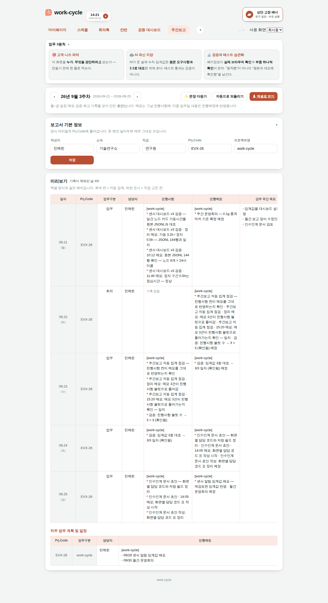

모바일: [`assets/pages/S06-report-mobile.png`](assets/pages/S06-report-mobile.png)

| 번호·영역 | 무엇을 보여주나 | 연결 코드·데이터 |
|---|---|---|
| ① 주차 바 | `26년 9월 3주차`, 기간, 이전/다음, 문장 다듬기, 자동으로 되돌리기, 엑셀로 받기 | `D.label`, `D.prev`, `D.next_week`, `/api/report/polish`, `DELETE /api/report/cell`, `/api/report/weekly.xlsx` |
| ② 보고서 기본 정보 | 작성자·소속·직급·Prj.Code·프로젝트명 | `report_settings` |
| ③ 미리보기 표 | 월~금 5행: 일자·Prj.Code·업무구분·담당자·진행사항·진행예정·금주 주간 목표 | `D.days[]`, `D.goal` |
| ④ 차주 계획 | 다음 주 등록 일정 | `D.next` |

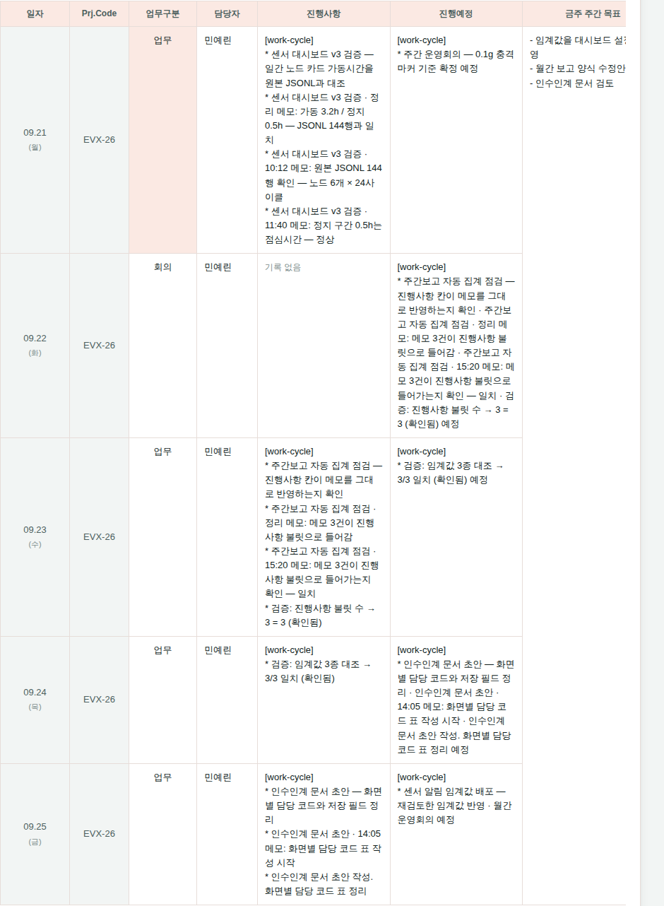

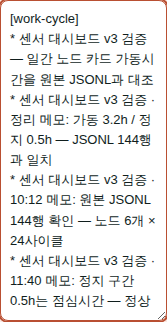

| 핵심 파일·심볼 | 역할 |
|---|---|
| `src/report.ts` `collect(db, email, mon)` | 한 주 기록을 8개 쿼리로 모아 `ReportData`로 조립. 보정값(`report_overrides`)이 있으면 그 칸은 보정값 우선 |
| `src/report.ts` `weekStart()`, `weekLabel()` | 어떤 날짜든 그 주 월요일; **그 달의 첫 월요일이 있는 주가 1주차** (2026-08-22 사용자 확정, 월요일 52개 전수 검증 기록은 `../weekly-report-design.md`) |
| `src/report.ts` `toXlsx(d)` / `src/xlsx.ts` `buildWorkbook()` | 양식과 같은 병합·열너비·서식의 xlsx를 외부 라이브러리 없이 생성(CRC32 + 무압축 ZIP + OOXML) |
| `index.ts` `/api/report/*` | 설정·주간 데이터·칸 보정·문장 다듬기·xlsx |
| `report.html` `render()`, `editCell()` | 표 그리기, 칸 클릭 편집(Ctrl+Enter 저장, Esc 취소, [자동] 되돌리기) |

| 단계·담당 함수 | 받는 값 | 처리·조건 | 반환값·부수 효과 | 화면 |
|---|---|---|---|---|
| F1 `load()` | `WEEK`(`?week=` 또는 빈 값) | `GET /api/report/weekly?week=` → `weekParam()`이 월요일로 정규화 → `collect()` | `ReportData + prev, next_week, file_name` | ①③④ |
| F2 `collect()` 조회 | `email, mon` | 병렬 8쿼리: `report_settings`, `report_overrides`(그 주), `schedules`(월~금), `schedule_logs`(월~금), `verifications`, `retros`, `kanban_cards`(즉시처리·전략적계획 8개), 다음 주 `schedules` | 원자료 | — |
| F3 날짜별 초안 | 하루치 일정·메모·검증·회고 | **진행사항 후보** = 진행이 있는 일정(`완료`이거나 `memo`가 있거나 시간순 메모가 있는 것)의 `제목 — 내용 첫 줄`, `제목 · 정리 메모: …`, 최근 시간순 메모 3건 `제목 · HH:MM 메모: …` + `검증: 항목 → 결과 (상태)`(미확인 제외) + 회고 요약 각 줄. `bullets()`가 중복 제거·`* ` 접두·1800자 제한 | `doneLines` | 진행사항 `[프로젝트]` + 불릿 |
| F4 진행예정 | 다음 날 초안 | 다음 업무일의 진행사항 후보(없으면 그날 일정 제목)를 `planSentence()`로 **한 문장**으로 압축하고 끝을 `예정`으로. 금요일은 다음 주 일정 제목. 그것도 없으면 그날의 미완료 일정·미확인 검증·회고의 내일 요청문 | `todo` | 진행예정 칸 |
| F5 보정값 적용 | `ovr` | `e:날짜`(진행사항), `f:날짜`(진행예정), `c:날짜`(업무구분), `goal`, `next`, `author`가 있으면 자동값 대신 사용. `edited[]`에 키 목록 | `days[]`, `goal`, `next`, `author` | 파란 표시 칸 |
| F6 칸 편집 저장 | `week, field, value`(4000자) | `PUT /api/report/cell`. 필드 형식 정규식 검사 | `report_overrides` UPSERT | F1 |
| F7 [자동] / [자동으로 되돌리기] | `week, field?` | `DELETE /api/report/cell`. `field` 없으면 그 주 전부 삭제 | — | F1 |
| F8 [✨ 문장 다듬기] | `week` | `POST /api/report/polish`: 손대지 않은 `e:`/`f:` 칸 중 내용 있는 것만 골라 **한 번의 AI 호출**로 다듬고, 달라진 칸만 `report_overrides`에 고정. AI 실패 시 `fallback:true`로 초안 유지 | `{updated, fields, provider, calls, limit}` 또는 `fallback` | 확인 창 → 결과 문구 |
| F9 [⬇ 엑셀로 받기] | `week` | `GET /api/report/weekly.xlsx?week=` → `toXlsx()` | 파일 `주간업무보고_26년 9월 3주차_민예린.xlsx` | 다운로드 |
| F10 기본 정보 저장 | `author, dept, role_name, prj_code, project, goal` | `PUT /api/report/settings` UPSERT (200자, goal 1000자) | — | F1 |

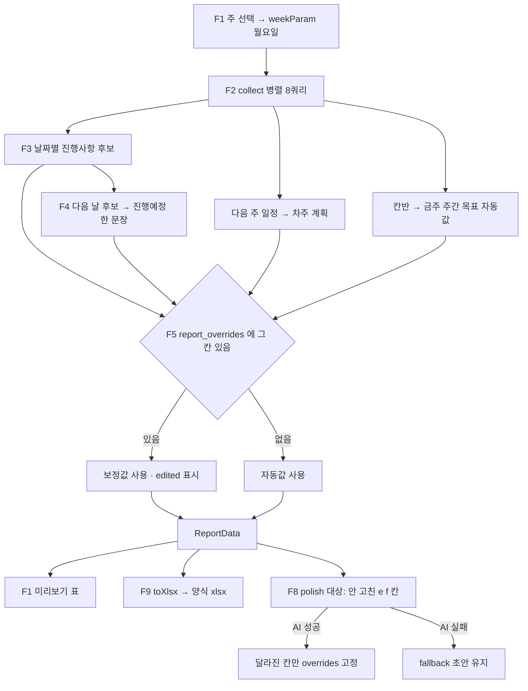
```mermaid
flowchart TD
  W[F1 주 선택 → weekParam 월요일] --> C[F2 collect 병렬 8쿼리]
  C --> D3[F3 날짜별 진행사항 후보]
  C --> N[다음 주 일정 → 차주 계획]
  C --> G[칸반 → 금주 주간 목표 자동값]
  D3 --> D4[F4 다음 날 후보 → 진행예정 한 문장]
  D3 & D4 & N & G --> O{F5 report_overrides 에 그 칸 있음}
  O -->|있음| OV[보정값 사용 · edited 표시]
  O -->|없음| AU[자동값 사용]
  OV & AU --> RD[ReportData]
  RD --> V[F1 미리보기 표]
  RD --> X[F9 toXlsx → 양식 xlsx]
  RD --> P[F8 polish 대상: 안 고친 e f 칸]
  P -->|AI 성공| UP[달라진 칸만 overrides 고정]
  P -->|AI 실패| FB[fallback 초안 유지]
```

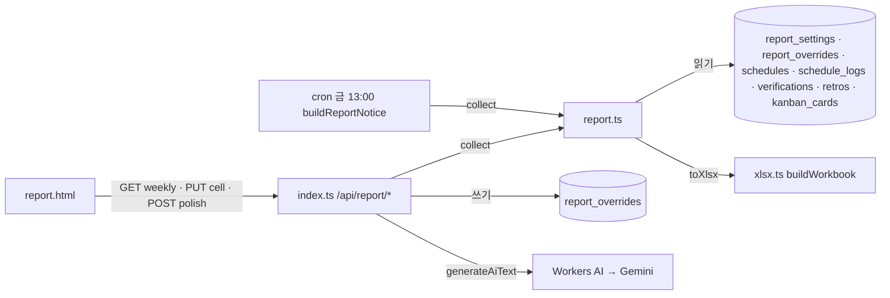
```mermaid
flowchart LR
  H[report.html] -->|GET weekly · PUT cell · POST polish| I[index.ts /api/report/*]
  I -->|collect| R[report.ts]
  R -->|읽기| D[(report_settings · report_overrides · schedules · schedule_logs · verifications · retros · kanban_cards)]
  I -->|쓰기| O[(report_overrides)]
  R -->|toXlsx| X[xlsx.ts buildWorkbook]
  I -->|generateAiText| AI[Workers AI → Gemini]
  CR[cron 금 13:00 buildReportNotice] -->|collect| R
```

| API·저장 연결 | 실제 내용 |
|---|---|
| 읽기·쓰기 | `report_settings(user_email PK, author, dept, role_name, prj_code, project, goal)`, `report_overrides(user_email, week_start, field, value, updated_at)` UNIQUE(user, week, field) |
| 작성자 기본값 | `overrides.author` → `report_settings.author` → 상수 `DEFAULT_REPORT_AUTHOR`("민예린"). 새 팀원이 쓰면 기본 정보에서 작성자를 바꿔야 합니다 |
| xlsx 배치 | 1행 제목(A1:F1 병합), 2행 `작성자 : 소속 이름 직급 / Last Rev. YY. MM. DD (금)`, 3행 머리, 4~8행 월~금, H4 주간 목표, 10행 차주 제목, 11행 머리(E11:F11 병합), 12행 차주 내용. 행 높이는 `heightFor()`가 한글 1.7배 가중치로 추정 |
| 수정 위치·영향 | 진행사항 문장 규칙은 `scheduleLines()`·`hasProgress()`, 진행예정은 `planSentence()`. 양식 열너비·병합은 `COLS`와 `toXlsx()`의 `merges`. 주차 규칙은 `weekLabel()` — 바꾸면 파일명·시트명·알림 문구가 함께 바뀜 |
| 수정 후 확인 | 월요일 일정에 메모 1건 → 월요일 진행사항에 `제목 · HH:MM 메모: …` 불릿, 일요일 전 주 진행예정에 한 문장. 칸 저장 → `edited`에 키, 새로고침 후 유지. xlsx를 열어 병합·열너비 확인 |

> 알려진 한계(HANDOFF): 금요일 **오후** 작업은 13:00 알림 초안에 없습니다. 퇴근 전 화면에서 보정하는 흐름을 전제로 합니다. 캡처의 진행예정 칸이 길게 이어진 것은 다음 날 후보 여러 줄을 ` · `로 잇는 `planSentence()`의 실제 동작입니다.

### S07 개인 마이페이지 `/personal` — 회사 기록과 분리된 개인 사이클

회사용 마이페이지와 같은 배치이지만 **계획·회고·체크리스트·결과 기록은 `personal_*` 테이블**에 따로 저장합니다. 스케줄·메모·퀵 기록·알림 연결은 회사 API를 그대로 씁니다. 화면 문구와 체크리스트 12개는 서버에 저장된 **화면 정의(`personal_ui_versions.definition` JSON)**에서 옵니다.

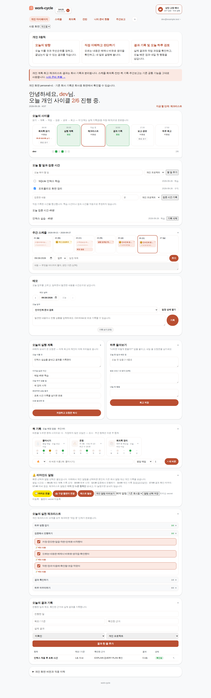

모바일: [`assets/pages/S07-personal-mobile.png`](assets/pages/S07-personal-mobile.png)

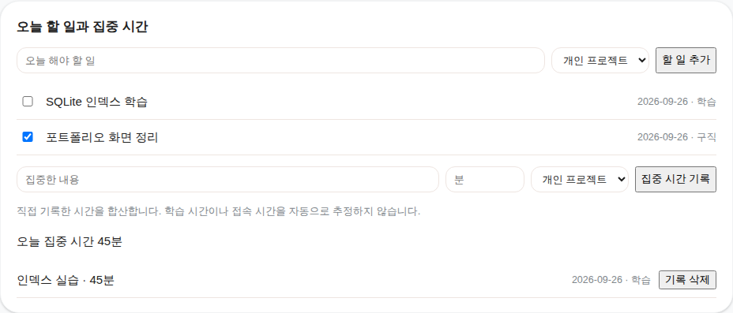

| 핵심 파일·심볼 | 역할 |
|---|---|
| `src/personal.ts` (Hono 하위 앱, `/api/personal`) | 개인 기록 전 라우트. 모든 응답에 `Cache-Control: private, no-store`, **GET이 아닌 요청은 `Origin`이 같은 사이트일 때만** 허용(403). 처리 오류는 이름만 로그하고 공통 500 문구 |
| `personal.ts` `personalSettings(db, email)` | `view_mode`, `reminder_mode`, `ui_version`. 행이 없으면 기본값 `company/company/personal-v1` |
| `personal.ts` `personalProfile(db, email, date, pin)` | 그날 쓸 화면 정의. `pin=true`면 `personal_days`에 **그날의 버전을 고정**(첫 기록 시). 정의는 `schema:1`이고 체크리스트가 있어야 함 |
| `personal.ts` `personalChecklist()`, `personalBoard()`, `personalSummary()` | 체크 상태 결합, 개인 보드 판정, 기간 집계 |
| `public/personal.html` | `index.html`을 복제해 `/api/personal/*`로 바꾼 화면. `MANUAL=["read","share"]` |
| `public/personal-ui.js` | 3원칙 카드 삽입, 폼 라벨을 `planLabels`/`retroLabels`로 치환, 알림 모드 저장·미리보기, 화면 버전 이력·적용 |
| `public/personal-edit.js` | 결과 기록 편집 모달(개인 API), 일정 편집 모달(회사 API 그대로) |

| 단계·담당 함수 | 받는 값 | 처리·조건 | 반환값·부수 효과 | 화면 |
|---|---|---|---|---|
| F1 `personal-ui.js init()` | 없음 | `GET /api/personal/ui`(오늘 프로필) → 3원칙 카드, 라벨 치환 → `GET /settings` → `GET /ui/history` | 상태 줄 "개인 화면 personal-v1 · …" | 헤더 아래 카드, 폼 라벨 |
| F2 `loadBoard()` | 없음 | `GET /api/personal/board`: `plan`=오늘 `personal_plans` 있음, `work`=**체크리스트 12개 전부** 체크, `verify`=삭제되지 않은 `personal_results` 있음, `retro`=`personal_retros` 있음, `read`/`share`=`personal_step_marks` | `{board:[나 1명], step_meta}` | 사이클 카드(팀원 행은 나 1명) |
| F3 할 일 / 집중 시간 | `title, category` / `note, minutes(1~1440 정수), category` | `POST /tasks`, `POST /focus`. 분류는 `구직·학습·개인 프로젝트`만, 아니면 `개인 프로젝트` | `personal_tasks`, `personal_focus` INSERT | 목록, "오늘 집중 시간 n분" |
| F4 할 일 체크 / 집중 삭제 | id | `PATCH /tasks/:id {done}`(내 것 아니면 404), `DELETE /focus/:id`(소프트 삭제 `deleted_at`) | — | F3 목록 |
| F5 실행 계획 저장 | 5개 칸 | `POST /plan`: 라벨 이름으로 `[오늘 이룰 것] …` 요청문 조립, `personal_plans` **UPSERT**(하루 1행), 프로필 버전 고정 | `{final_prompt}` → 클립보드 | 보드 `plan` |
| F6 회고 저장 | 3개 칸 | `POST /retro` UPSERT | — | 보드 `retro`, 내일 `prefill`(어제 이전 최근 회고) |
| F7 체크·메모 | `item_id, checked` / `memo` | `POST /checks`, `PUT /checklist/:itemId/memo` → `personal_checks` UPSERT(버전·항목별). 프로필에 없는 항목 404 | — | 배지, 보드 `work` |
| F8 결과 기록 | `item, formula, method, result, status, category` | `POST /verifications` → `personal_results`. 편집 `PATCH`, 삭제는 `deleted_at` | — | 표, 보드 `verify` |
| F9 알림 모드 | `reminder_mode` | `PUT /settings`. 화면 모드와 별개 필드. 미리보기 `GET /reminders/preview`(17:40 문구) | — | 상태 줄 |
| F10 화면 버전 적용 | `version, base_version` | `POST /ui/activate`: 정의 존재·`schema:1` 확인 → `personal_settings.ui_version`을 **비교 후 교체**(base가 다르면 409) + `personal_ui_events` 기록을 같은 batch로 | `{note}` | 이력 목록. 이미 기록한 날짜는 당시 버전 유지 |

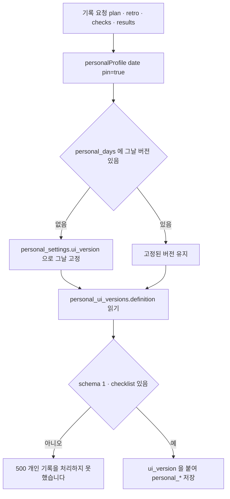
```mermaid
flowchart TD
  W[기록 요청 plan · retro · checks · results] --> PF[personalProfile date pin=true]
  PF --> PD{personal_days 에 그날 버전 있음}
  PD -->|없음| INS[personal_settings.ui_version 으로 그날 고정]
  PD -->|있음| KEEP[고정된 버전 유지]
  INS --> DEF[personal_ui_versions.definition 읽기]
  KEEP --> DEF
  DEF --> CHK{schema 1 · checklist 있음}
  CHK -->|아니오| ERR[500 개인 기록을 처리하지 못했습니다]
  CHK -->|예| SAVE[ui_version 을 붙여 personal_* 저장]
```

| API·저장 연결 | 실제 내용 |
|---|---|
| 읽기·쓰기 | `personal_settings`, `personal_ui_versions`(v28 시점 `personal-v1` 1행, 마이그레이션 0016이 INSERT), `personal_days`, `personal_plans`, `personal_retros`, `personal_checks`, `personal_results`, `personal_tasks`, `personal_focus`, `personal_step_marks`, `personal_ui_events` |
| 회사 기록과의 경계 | 개인 화면에서 저장해도 `checks`, `verifications`, `ai_requests`, `retros`는 바뀌지 않습니다(테스트 `tests/personal-mode.test.mjs`가 `/api/checklist` 전후를 비교) |
| 수정 위치·영향 | 개인 체크리스트 문구·3원칙·라벨은 코드가 아니라 **새 `personal_ui_versions` 행**으로 추가하고 화면에서 [버전 적용]. 기존 행을 UPDATE하면 과거 날짜의 표시도 바뀝니다 |
| 수정 후 확인 | 다른 이메일로 `PATCH /tasks/:id` → 404. `Origin`을 다른 사이트로 `PUT /settings` → 403. 12개 전부 체크 → 보드 `work` 완료, 1개 해제 → 미완료 |

### S08 나의 준비 현황 `/personal-dashboard` — 기간·분류별 개인 집계

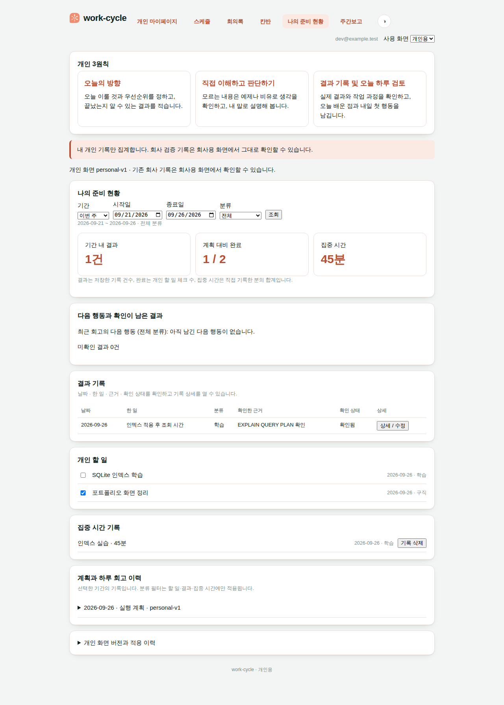

모바일: [`assets/pages/S08-personal-dashboard-mobile.png`](assets/pages/S08-personal-dashboard-mobile.png)

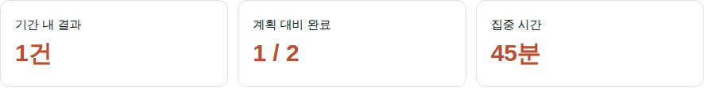

| 단계·담당 함수 | 받는 값 | 처리·조건 | 반환값·부수 효과 | 화면 |
|---|---|---|---|---|
| F1 `personalFilters` | `period`(이번 주/이번 달/직접), `from`, `to`, `category` | `setPeriod()`가 월요일 또는 1일로 `from`을 채움 | — | 필터 |
| F2 `refresh()` | 필터 | `GET /api/personal/dashboard?from&to&category`: 기간 366일 이내, 분류 화이트리스트. `personalSummary()`가 결과·할 일·집중·최근 회고를 병렬 조회 | `{results, tasks, focus, next, summary{results, tasks, done, focus_minutes, unchecked}}` | 타일, 표, 목록 |
| F3 이력 | 같은 기간 | `GET /api/personal/journal?from&to`: `personal_plans`(실행 계획)와 `personal_retros`(하루 회고)를 UNION | `rows[{cycle_date, ui_version, kind, body}]` | 접이식 이력 |
| F4 결과 [상세 / 수정] | 행 | `openVerifModal` (개인 API) → `refresh()` | — | 표 |

- 타일 뜻: **결과** = 저장한 `personal_results` 건수(삭제 제외), **완료** = 체크한 할 일 / 전체 할 일, **집중 시간** = 직접 기록한 분의 합. 접속 시간을 추정하지 않습니다.
- 분류 필터는 할 일·결과·집중 시간에만 적용되고 "다음 행동"(최근 회고)은 전체 분류입니다.

---

## 3. 화면 없는 기능 (S09)

### S09-A 카카오 리마인드 — Cron 1개 표현식을 KST 시간표로 갈라 보내기

무료 플랜 트리거 3개 한도 때문에 **표현식 하나** `0,25,30,40 23,1,3,4,8 * * *`(UTC)로 받고, 코드가 KST 시각을 보고 `SLOTS`에서 보낼 것을 고릅니다. 표에 없는 조합(예: UTC 23:00 = KST 08:00)은 그냥 통과합니다.

| KST | `SLOTS` 항목 | 문구를 만드는 함수 | 내용 |
|---|---|---|---|
| 08:25 | `brief morning` | `buildReminder(env, email, "morning")` | 구글 캘린더 오늘 일정(최대 8), work-cycle 스케줄, 안 읽은 전 영업일 회의록(5), 어제 회고의 내일 요청문 |
| 10:00 | `checklist ["하루 시작"]` | `buildChecklistReminder()` | 그 섹션에서 **아직 안 누른 항목만**(8개 + "외 n개"). 다 눌렀으면 `null` → 발송 안 함 |
| 12:30 | `checklist ["작업 중","AI 사용"]` | 같음 | 같음 |
| 13:00 금요일만 (`dow:5`) | `report` | `buildReportNotice()` | 주차 라벨, 기록이 채워진 날 n/5, 요일별 ○/—, `/report` 링크 |
| 17:00 | `checklist ["제출 전"]` | 같음 | 같음 |
| 17:40 | `brief evening` | `buildReminder(…, "evening")` | 사이클 n/6와 남은 단계, 퀵 기록 달성 n/m과 미달 4개 |

| 단계·담당 함수 | 받는 값 | 처리·조건 | 반환값·부수 효과 | 다음 소비자 |
|---|---|---|---|---|
| F1 `scheduled(controller, env, ctx)` | `scheduledTime` | KST로 변환. 토·일이면 종료. `hhmm`이 `SLOTS`에 없으면 종료. `dow` 지정 슬롯은 요일 불일치 시 종료 | 없음. `ctx.waitUntil(runSlot)` | F2 |
| F2 `runSlot(env, slot)` | 슬롯 | 대상 = `oauth_tokens.provider='kakao'`인 사용자 중 나가지 않은 계정. 사용자마다 `personalSettings().reminder_mode`가 `personal`이면 `buildPersonalReminder(db, email, hhmm)`, 아니면 슬롯 종류별 함수. 문구가 `null`이면 발송 없음. 실패는 `console.log`만(이메일·토큰 비노출) | 없음 | F3 |
| F3 `sendKakaoMemo(env, email, text, personal)` | 문구(1900자에서 자름) | `freshAccessToken(kakao)` → 없으면 실패 반환. `kapi.kakao.com/v2/api/talk/memo/default/send`에 텍스트 템플릿 + 버튼("work-cycle 열기" 또는 "개인 화면 열기") | `{ok, detail}` | 로그 |
| F4 `freshAccessToken(env, email, provider)` | 제공자 | `oauth_tokens`에서 읽어 만료 60초 전이면 그대로. 아니면 refresh 요청 → `saveToken()`(새 refresh_token이 오면 교체) | 액세스 토큰 또는 `null` | F3, 캘린더 |
| F5 `buildPersonalReminder(db, email, slot)` | 슬롯 시각 | 10:00/12:30/17:00은 개인 체크리스트 섹션(`하루 방향 잡기` / `집중해서 진행하기` / `결과 확인하기`+`하루 마무리하기`)의 안 누른 항목. 그 외는 개인 사이클 n/6, 계획 대비 완료, 집중 시간, 결과·미확인 건수, 미완료 할 일 3개 | 문구 또는 `null` | F3 |

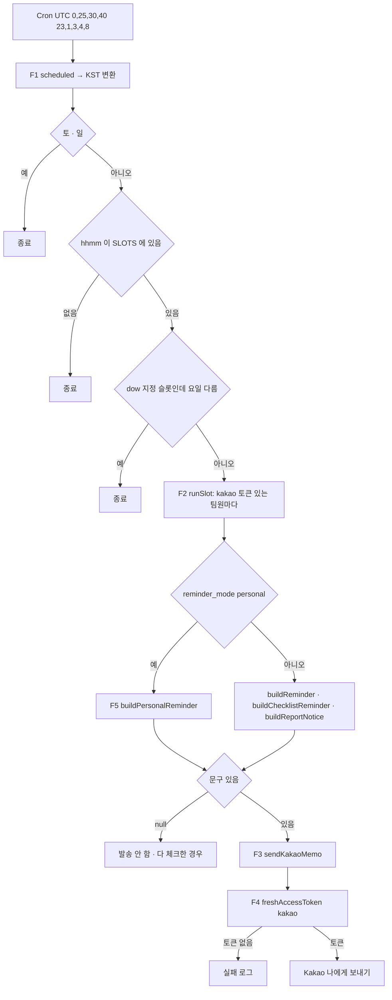
```mermaid
flowchart TD
  C[Cron UTC 0,25,30,40 23,1,3,4,8] --> S[F1 scheduled → KST 변환]
  S --> WD{토 · 일}
  WD -->|예| END1[종료]
  WD -->|아니오| SL{hhmm 이 SLOTS 에 있음}
  SL -->|없음| END2[종료]
  SL -->|있음| DW{dow 지정 슬롯인데 요일 다름}
  DW -->|예| END3[종료]
  DW -->|아니오| RS[F2 runSlot: kakao 토큰 있는 팀원마다]
  RS --> PM{reminder_mode personal}
  PM -->|예| PR[F5 buildPersonalReminder]
  PM -->|아니오| CO[buildReminder · buildChecklistReminder · buildReportNotice]
  PR --> T{문구 있음}
  CO --> T
  T -->|null| SKIP[발송 안 함 · 다 체크한 경우]
  T -->|있음| SEND[F3 sendKakaoMemo]
  SEND --> TK[F4 freshAccessToken kakao]
  TK -->|토큰 없음| FAIL[실패 로그]
  TK -->|토큰| API[Kakao 나에게 보내기]
```

- 화면 미리보기: `GET /api/reminders/preview?when=morning|evening|1000|1230|1300|1700`, 시간표 안내: `GET /api/reminders/slots`, 실제 발송 테스트: `POST /api/reminders/test {when, profile}`.
- 수정 위치: 시각을 추가하면 `wrangler.toml`의 cron(대시보드 트리거도 수동 수정)과 `SLOTS` 둘 다. `0-4` 같은 요일 범위는 Cloudflare가 거부합니다(AGENTS.md 3장).
- 주간보고 문장 다듬기는 cron에서 돌리지 않습니다(사람 수만큼 AI 한도를 소진하므로, `/api/report/polish` 주석).

### S09-B OAuth 연결 — 카카오·구글 토큰을 D1에 보관

| 경로 | 처리 | 저장 |
|---|---|---|
| `GET /auth/kakao/start` | `KAKAO_REST_KEY` 없으면 500. `scope=talk_message`로 카카오 인가 화면으로 리다이렉트 | — |
| `GET /auth/kakao/callback` | `code`로 토큰 교환(실패 시 카카오 원문 300자). `users` upsert 후 `saveToken` → `/?connected=kakao` | `oauth_tokens(user_email, 'kakao', access_token, refresh_token, expires_at)` |
| `GET /auth/google/start` | `GOOGLE_CLIENT_ID` 없으면 500. `scope=calendar.events`, `access_type=offline`, `prompt=consent`(재연결 때도 refresh_token 재발급) | — |
| `GET /auth/google/callback` | 토큰 교환. refresh_token이 없고 기존 저장도 없으면 안내 문구(구글 계정 서드파티 액세스에서 삭제 후 재연결) | `oauth_tokens(..., 'google', ...)` |

- `redirect_uri`는 `APP_URL`(기본 `https://<your-worker>.workers.dev`) + 콜백 경로. 로컬에서는 카카오·구글 콘솔에 로컬 주소가 등록돼 있지 않으면 콜백이 오지 않습니다.
- `saveToken()`은 refresh_token이 있을 때만 UPSERT, 없으면 access_token만 UPDATE. HANDOFF 7장: 구글 앱이 테스트 모드라 refresh token이 **7일 만료**(앱 게시 필요).
- 보존 범위(AGENTS.md 2-2): 이 갱신 로직은 손대지 않는 것이 규칙입니다.

### S09-C 화상회의 만들기 — 일정 → Google Calendar 이벤트 + Meet 링크

| 단계 | 처리 |
|---|---|
| F1 `POST /api/schedules/:id/meet` | 내 일정만(404). 이미 `meet_url`이 있으면 재사용 반환 |
| F2 시간 계산 | `start_time` 없으면 09:00, `end_time` 없으면 시작+1시간. `Asia/Seoul` |
| F3 Calendar API | `events?conferenceDataVersion=1`에 `conferenceData.createRequest`(`requestId=wc-<id>-<date>`) |
| F4 실패 판별 | 본문 **전문**으로 판별하고 표시만 400자: API 미사용(`accessNotConfigured`) → 켜는 방법 안내, 권한 부족/401 → 재연결 안내, 그 외 → 구글이 준 이유 원문 |
| F5 저장 | `schedules.meet_url`, `meet_event_id`. 해제 `DELETE …/meet`는 캘린더 이벤트도 삭제 시도 후 두 열을 NULL |

### S09-D 기타 API

| 경로 | 무엇 | 비고 |
|---|---|---|
| `GET /api/health` | `{ok, date}` | 배포 확인용 |
| `GET /api/me` | 이메일, 오늘(KST), `team_member` | 모든 화면의 첫 호출 |
| `GET /api/config` | `kakao_js_key` | 화면 공유 버튼용 SDK 키. 없으면 `null` |
| `GET /api/widget/now` | 지금 할 단계 | PC 위젯(①)은 미착수, API만 있음 |
| `GET /api/downloads/desktop-banner` | `public/downloads/work-cycle-desktop-banner.pyw`를 `attachment`로 | 헤더의 [최초 1회 설치]. 실행 뒤 `workcycle-banner://start?text=`로 배너를 켬(`tools/desktop-banner/`) |
| `POST /api/team-membership/leave` | `team_membership_exits`에 기록 | 계정·기록·토큰은 보존. 보드·집계·알림·팀 일정에서만 제외. 되돌리는 API는 없음(행 삭제는 DB에서) |
| `GET/POST /api/git_targets` | 이슈 생성용 기본 레포 | `is_default` 1개 |

---

## 4. 저장 구조와 데이터 관계

### 4-1. 저장소 경계

| 저장소 | 역할 | 실제 위치 |
|---|---|---|
| D1 `work-cycle-db` | 모든 업무·개인 기록, OAuth 토큰, 설정 | 운영: Cloudflare, `database_id`는 `wrangler.toml`. 로컬: `.wrangler/state/v3/d1/…sqlite` |
| 브라우저 `localStorage` | 접힘 상태·다크 모드·발표 모드·배너 문구 (기기별, 서버에 없음) | 키 목록은 1-4 표 |
| R2 `work-cycle-files` | 설계상 회의록 원문·리뷰 이미지 용도 | **미사용** — `wrangler.toml`에서 주석 처리. `meetings.r2_key`, `review_targets`, `pins`는 스키마만 있고 라우트 없음 |
| 외부 | GitHub(볼트 원문은 읽기만, 이슈는 쓰기), Google Calendar 이벤트, 카카오 메시지 | 앱은 URL·id만 저장 |

### 4-2. 전체 관계도

관계 이름에 `FK`가 붙은 것은 D1 스키마에 선언된 외래키(`REFERENCES`), `(논리)`는 코드가 `user_email`·id로 맞추는 연결(DB가 강제하지 않음)입니다. 로컬 D1은 `PRAGMA foreign_keys = 1`이었고, 일정을 삭제하면 `schedule_logs`가 `ON DELETE CASCADE`로 함께 지워지는 것을 확인했습니다(코드에는 별도 삭제가 없음). `users`를 가리키는 논리 연결은 한 그림에 모으면 읽기 어려워 두 그림으로 나눴습니다.

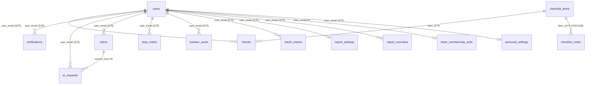
```mermaid
erDiagram
  users ||--o{ checks : "user_email (논리)"
  users ||--o{ verifications : "user_email (논리)"
  users ||--o{ ai_requests : "user_email (논리)"
  users ||--o{ retros : "user_email (논리)"
  users ||--o{ step_marks : "user_email (논리)"
  users ||--o{ kanban_cards : "user_email (논리)"
  users ||--o{ oauth_tokens : "user_email (논리)"
  users ||--o| report_settings : "user_email (논리)"
  users ||--o{ report_overrides : "user_email (논리)"
  users ||--o| team_membership_exits : "user_email FK"
  users ||--o| personal_settings : "user_email (논리)"
  checklist_items ||--o{ checks : "item_id FK"
  checklist_items ||--o{ checklist_notes : "item_id FK CASCADE"
  retros ||--o{ ai_requests : "reused_from FK"
```

일정·회의·습관 쪽 (모두 `user_email`로 `users`에 논리 연결되지만 선은 생략):

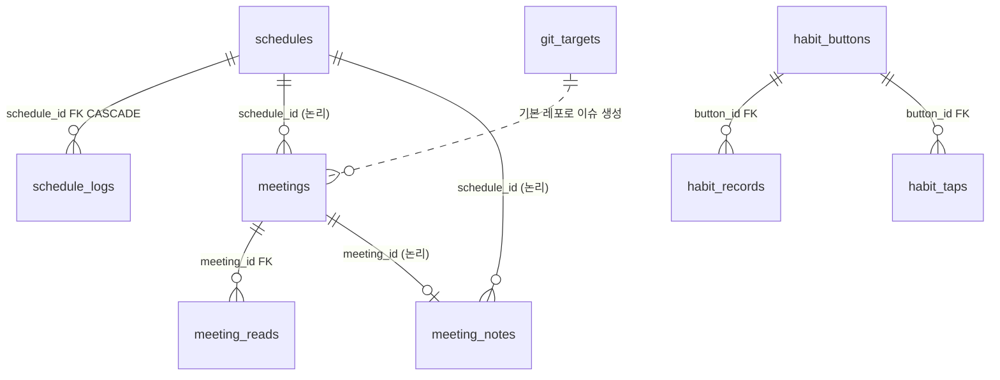
```mermaid
erDiagram
  schedules ||--o{ schedule_logs : "schedule_id FK CASCADE"
  schedules ||--o{ meetings : "schedule_id (논리)"
  schedules ||--o{ meeting_notes : "schedule_id (논리)"
  meetings ||--o{ meeting_reads : "meeting_id FK"
  meetings ||--o| meeting_notes : "meeting_id (논리)"
  git_targets ||..o{ meetings : "기본 레포로 이슈 생성"
  habit_buttons ||--o{ habit_records : "button_id FK"
  habit_buttons ||--o{ habit_taps : "button_id FK"
```

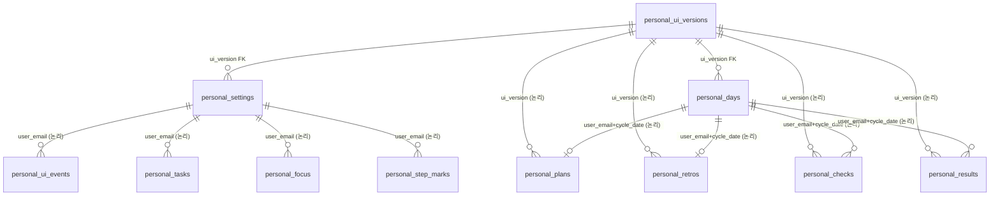
```mermaid
erDiagram
  personal_ui_versions ||--o{ personal_settings : "ui_version FK"
  personal_ui_versions ||--o{ personal_days : "ui_version FK"
  personal_ui_versions ||--o{ personal_plans : "ui_version (논리)"
  personal_ui_versions ||--o{ personal_retros : "ui_version (논리)"
  personal_ui_versions ||--o{ personal_checks : "ui_version (논리)"
  personal_ui_versions ||--o{ personal_results : "ui_version (논리)"
  personal_settings ||--o{ personal_ui_events : "user_email (논리)"
  personal_days ||--o| personal_plans : "user_email+cycle_date (논리)"
  personal_days ||--o| personal_retros : "user_email+cycle_date (논리)"
  personal_days ||--o{ personal_checks : "user_email+cycle_date (논리)"
  personal_days ||--o{ personal_results : "user_email+cycle_date (논리)"
  personal_settings ||--o{ personal_tasks : "user_email (논리)"
  personal_settings ||--o{ personal_focus : "user_email (논리)"
  personal_settings ||--o{ personal_step_marks : "user_email (논리)"
```

### 4-3. 핵심 테이블 스키마 (화면과 연결)

마이그레이션 `0001`~`0016`을 번호 순서로 적용한 결과입니다. 아래는 화면에서 자주 만나는 열만 적었고, 전체 열은 각 SQL 파일에 있습니다.

**`schedules`** — 일정 (S01-B·S02·S06·S09-C)

| 열 | 타입 | 필수 | 기본값 | 키 | 쉬운 뜻·화면 |
|---|---|---|---|---|---|
| `id` | INTEGER | 예 | 자동 증가 | PK | 일정 번호. `schedule_logs`, `meetings`, `meeting_notes`가 가리킴 |
| `user_email` | TEXT | 예 | — | 논리 → `users` | 소유자. 수정·삭제·메모는 본인만 |
| `date` | TEXT | 예 | — | — | `YYYY-MM-DD`. 주간·월간 조회 키 |
| `block_type` | TEXT | 예 | `'가능'`(스키마) | — | 실제 값은 `업무`/`회의`뿐. 0012가 나머지를 `업무`로 정규화 |
| `title`, `body`, `memo` | TEXT | 제목만 필수 | NULL | — | 제목, 내용(무엇을 어디까지), 정리 메모 |
| `start_time`, `end_time` | TEXT | 아니오 | NULL | — | `HH:MM`. 정렬·Meet 시간 |
| `status` | TEXT | 예 | `'미완료'` | — | `미완료`/`완료`. 주간보고 진행사항 후보 조건 |
| `confirm_line`, `confirmed` | TEXT, INTEGER | 아니오 / 예 | NULL / 0 | — | 요구사항 한 줄 확인과 확인받음 여부. `?` 배지 |
| `meet_url`, `meet_event_id` | TEXT | 아니오 | NULL | — | Meet 링크, 캘린더 이벤트 id |

**`schedule_logs`** — 시간순 메모 (S01-C·S06)

| 열 | 타입 | 필수 | 기본값 | 키 | 쉬운 뜻 |
|---|---|---|---|---|---|
| `schedule_id` | INTEGER | 예 | — | FK → `schedules` CASCADE | 어느 업무의 메모인지 |
| `body` | TEXT | 예 | — | CHECK 1~1000자 | 메모 본문 |
| `logged_date`, `logged_time` | TEXT | 예 | — | — | KST 날짜·`HH:MM`. 새 메모는 오늘만 |

**`verifications`** — 검증 기록 (S01-H·S05·S06)

| 열 | 타입 | 필수 | 기본값 | 쉬운 뜻 |
|---|---|---|---|---|
| `cycle_date` | TEXT | 예 | — | 어느 날의 사이클 기록인지. 보드 `verify` 판정 키 |
| `item`, `formula`, `method`, `result` | TEXT | 항목만 필수 | `''` | 항목, 계산식, 검증 방법, 결과 |
| `status` | TEXT | 예 | `'미확인'` | `확인됨`/`불일치→수정`/`미확인`. 대시보드 타일, 주간보고 조건 |

**`checklist_items` / `checks` / `checklist_notes`** — 체크리스트 (S01-G·S09-A)

| 테이블·열 | 뜻 |
|---|---|
| `checklist_items(section, text, sort, active)` | 항목 원본. `section`은 `하루 시작`/`작업 중`/`AI 사용`/`제출 전`. 알림 슬롯이 이 이름으로 골라냄 |
| `checks(item_id, user_email, cycle_date)` UNIQUE | 오늘 체크. 삭제로 해제 |
| `checklist_notes(item_id, user_email, cycle_date, memo)` UNIQUE, CHECK 1~1000자 | 항목별 메모. 체크와 독립 |

**`meetings` / `meeting_reads` / `meeting_notes`** — 회의록 (S03)

| 테이블·열 | 뜻 |
|---|---|
| `meetings(date, title, body_mode, body_md, link, gh_issue_url, schedule_id, created_by, r2_key)` | 회의록. `body_mode` 실제 값 `link_only`/`full_md`/`full`(S03-C 표). `link`는 URL 또는 볼트 경로. `r2_key`는 미사용 |
| `meeting_reads(meeting_id, user_email)` UNIQUE | 읽음. `read` 단계 근거 |
| `meeting_notes(..., outline JSON, meeting_id, schedule_id)` | 회의 중 메모. `outline`은 `[{d,m,t,who,due}]` |

**`habit_buttons` / `habit_records` / `habit_taps`** — 퀵 기록 (S01-E·S09-A)

| 테이블·열 | 뜻 |
|---|---|
| `habit_buttons(name, emoji, goal, repeat_type, repeat_days, active)` | 버튼. `repeat_type`은 `daily`/`selected`/`weekly`, `repeat_days`는 ISO 요일 `'1,2,3,4,5'` 형식 |
| `habit_records(button_id, date, count)` UNIQUE(button, date) | 날짜별 횟수 |
| `habit_taps(button_id, date, tapped_time)` | 누른 시각(`HH:MM`) 낱개 |

**`report_settings` / `report_overrides`** — 주간보고 (S06): 2장 S06 표 참고. `report_overrides.field`는 `e:날짜`/`f:날짜`/`c:날짜`/`goal`/`next`/`author`.

**`oauth_tokens`** — (S09-A·B): `(user_email, provider)` UNIQUE, `refresh_token` 필수, `expires_at`은 epoch ms.

**`ai_usage`** — `(user_email, date)` UNIQUE, `calls`. 회의록 요약과 문장 다듬기가 공유하는 하루 20회 카운터.

**`personal_*`** — (S07·S08): 0016 한 파일에 정의. 핵심은 `personal_ui_versions(id, label, definition JSON)`과 각 기록 테이블의 `ui_version` 열, `personal_days(user_email, cycle_date, ui_version)` PK로 날짜별 버전 고정.

### 4-4. 스키마·코드·운영 대조에서 확인한 차이

| 항목 | 스키마·문서 | 코드 실제 | 영향 |
|---|---|---|---|
| `meetings.body_mode` | 주석 `link_only | full` | `link_only`, `full_md`, `full` 세 값 | 화면은 `full_md`만 볼트 경로로 해석. 새 값 추가 시 `meetingSourceHref()` 확인 |
| `schedules.block_type` 기본값 | `'가능'` | 코드는 항상 `업무`/`회의`로 정규화 | DB 직접 INSERT 시 `가능`이 생길 수 있음. 0012 UPDATE를 재실행하면 정리됨 |
| `work` 단계 기준 | README "1개 이상 체크" | 보드·도넛 19개, 저녁 알림 1개 | S01-A 참고. README 문구는 M1 시점 |
| `verifications.status` 기본 | `'미확인'` | 화면 `<select>` 첫 값도 `미확인` | 일치 |
| `kanban_cards.sort` | 정렬 열 | 항상 0, 정렬 UI 없음 | 이동 순서는 `id` |
| `review_targets`, `pins`, `meetings.r2_key` | 0001에 정의 | 라우트 없음(화면 핀 댓글 ③ 미착수) | 삭제하지 말 것 — 설계 유지 |
| 원격 마이그레이션 상태 | HANDOFF "0009까지 확인(2026-08-23)" | DEPLOY.md에 0010~0015 수동 적용 절차 존재, 0016은 절차 없음 | 운영 D1의 실제 적용 여부는 **이 문서에서 확인하지 못함**. `pragma_table_info`·`d1_migrations`로 확인 필요 |

---

## 5. 실행·변경·배포·복구

### 5-1. 환경 설정

| 변수·시크릿 | 역할 | 없을 때 동작 |
|---|---|---|
| `DEV_EMAIL` (`.dev.vars`) | 로컬에서 Access 헤더 대신 사용 | `/api/*` 401 |
| `AI` 바인딩 (`wrangler.toml [ai]`) | Workers AI | Gemini 키로 대체, 둘 다 없으면 요약·다듬기 400 |
| `GEMINI_API_KEY`, `GEMINI_MODEL` | Gemini 대체 경로. `dev-mock`이면 모의 응답(로컬) | — |
| `GITHUB_TOKEN`, `GITHUB_TOKEN_VAULT` | 이슈 생성·이슈 목록 / 볼트 읽기(볼트 토큰 우선) | 400 안내 문구 |
| `VAULT_REPO`, `VAULT_DIR` | 볼트 미러 레포·루트 폴더 | 기본 `feed-mina/ME`, `daily` |
| `KAKAO_REST_KEY`, `KAKAO_CLIENT_SECRET`, `KAKAO_JS_KEY` | 카카오 OAuth·발송 / 화면 공유 SDK | 연결 500, 상태 "secret 미등록" |
| `GOOGLE_CLIENT_ID`, `GOOGLE_CLIENT_SECRET` | 구글 OAuth | 연결 500 |
| `APP_URL` | OAuth 콜백·알림 링크의 기준 주소 | 기본 운영 주소 |

시크릿은 전부 `npx wrangler secret put <이름>` 또는 Cloudflare 대시보드. 레포·화면·로그에 값이 나오지 않게 합니다(AGENTS.md 2-3).

### 5-2. 로컬 실행과 검증 (이 문서 작성 시 실제로 수행한 순서)

| 작업 | 실행 위치·환경 | 명령 | 성공 확인 |
|---|---|---|---|
| 의존성 | 레포 루트, Node 22 | `npm ci` | `node_modules/` 생성 |
| 타입 검사 | 레포 루트 | `npx tsc --noEmit` | 출력 없이 종료 |
| 인라인 JS 문법 | 레포 루트 | AGENTS.md 2-1의 `node -e` 한 줄 | `OK` |
| 로컬 DB | 레포 루트 | `for f in migrations/*.sql; do npx wrangler d1 execute work-cycle-db --local --file=$f; done` 후 `--file=seed/seed.sql` | `checklist_items` 21행, 테이블 목록에 `personal_*` |
| 개발 서버 | 레포 루트, `.dev.vars`에 `DEV_EMAIL`, `GEMINI_API_KEY=dev-mock` | `npx wrangler dev --local --port 8788` | `GET /api/health` → `{"ok":true}` |
| 개인 모드 테스트 | 서버 실행 중 | `TEST_BASE_URL=http://127.0.0.1:8788 node tests/personal-mode.test.mjs` | `PASS: … API checks` (아래 6장 결과) |
| 화면 확인 | Playwright + `/opt/pw-browsers/chromium` | 데스크톱 1280·모바일 420에서 페이지 8개 캡처, `scrollWidth - clientWidth` 측정 | 가로 넘침 0 (6장) |

### 5-3. 변경 지점 요약

| 바꾸려는 것 | 위치 | 함께 확인 |
|---|---|---|
| 화면 문구·배치 | `public/<화면>.html` 인라인 | 인라인 JS 문법 검사, 아코디언 `id`가 내부 요소 `id`와 겹치지 않는지(AGENTS.md의 v5 회귀 사례) |
| 단계 완료 규칙·시각 | `index.ts` `STEP_META`, `/api/widget/now`, `CHECKLIST_COMPLETE_MIN`, `/api/board`, `/api/cycle_history`, `buildReminder` | S01-A, S02, S09-A가 같은 값을 쓰는지 |
| API 추가 | `index.ts`(회사) / `personal.ts`(개인) | `Env` 타입, 본인 소유 검사(`user_email`), 오류 원문 노출 규칙 |
| 스키마 | `migrations/00NN_*.sql` 새 파일 | `ALTER TABLE`은 재실행 불가 → DEPLOY.md 블록 A/B/C 절차와 `d1_migrations` 기록 보정 |
| 체크리스트 항목 | DB `checklist_items` 직접 (`active=0`, 새 행) | `seed.sql` 재실행 금지 |
| 개인 화면 문구 | `personal_ui_versions` 새 행 + 화면에서 [버전 적용] | `schema:1`, `checklist[].id` 유지 |
| 주간보고 양식 | `report.ts` `COLS`, `toXlsx()` | 엑셀로 열어 병합·열너비 |
| 알림 시각 | `wrangler.toml` cron + 대시보드 트리거 + `SLOTS` | `/api/reminders/preview?when=` |

### 5-4. 테스트와 빌드

| 검사 | 명령 | 범위 |
|---|---|---|
| 타입 | `npx tsc --noEmit` | `src/*.ts` |
| 인라인 JS 문법 | AGENTS.md 2-1 | `public/*.html`의 `<script>` |
| 개인 모드 E2E(End-to-End, 입력부터 결과까지 연결 확인) | `tests/personal-mode.test.mjs` | `/api/personal/*` 소유권 분리·회사 기록 보존·집계·알림 미리보기·JS 문법. 로컬(`127.0.0.1`/`localhost`)에서만 실행되게 막혀 있음. 외부 메시지 발송 없음 |
| 회사 API 자동 테스트 | 없음 | 브라우저 조작으로 부품별 확인(AGENTS.md 2-1) |
| 빌드 | 없음 (`git push` → Cloudflare 자동 빌드) | — |

### 5-5. 배포와 복구 (실행하지 않고 저장소 절차만 옮김)

1. 새 마이그레이션 SQL을 **먼저** Cloudflare 대시보드 D1 콘솔에 붙여넣기 (재실행 불가 `ALTER`는 한 줄씩, 재실행 안전 문장은 묶어서, 마지막에 `d1_migrations` 기록 보정). 이유: 작업 PC의 `CLOUDFLARE_ACCOUNT_ID` 불일치로 `wrangler d1 … --remote`가 다른 계정으로 나감(DEPLOY.md).
2. `git push` → 자동 빌드·배포.
3. cron 표현식이 바뀐 경우에만 대시보드 트리거 수정.
4. `Ctrl+Shift+R`로 열어 확인(Workers Assets 캐시).
5. 시크릿은 `wrangler secret put`.

복구: D1 → R2 정기 백업은 미착수(HANDOFF). 데이터 복구 수단은 현재 Cloudflare D1 자체 기능뿐이며 이 문서에서 검증하지 않았습니다. 코드 되돌리기는 `git revert` 후 push.

### 5-6. 문제 진단

| 증상 | 먼저 볼 위치 | 판단 기준 | 조치 |
|---|---|---|---|
| 배포 직후 화면 전체 500 | Workers 로그의 SQL 오류 (`no such column/table`) | 새 코드가 쓰는 열이 원격 D1에 없음 | 마이그레이션을 콘솔에 적용 후 새로고침 |
| `duplicate column`인데 컬럼은 없음 | `pragma_table_info('테이블')` | `d1_migrations` 기록만 있고 실제 열 없음 | 실재 확인 후 기록 보정 (AGENTS.md 3장) |
| 화면이 안 바뀜 | 브라우저 | Assets 캐시 | `Ctrl+Shift+R` |
| 사이클 보드 `work`가 완료 안 됨 | `/api/board`의 `checks` 수 | 활성 항목 19개 미만 | 정상 동작. 기준은 `CHECKLIST_COMPLETE_MIN` |
| 회의록 읽기 단계가 비어 있음 | `/api/board`의 `meeting_read_date` | 그 날짜 `meetings`가 없거나 `meeting_reads` 없음 | S03-C 옵시디언 가져오기 → 읽음 처리 |
| 볼트 조회 400/502 | 화면 alert 원문 | 토큰 미설정 / GitHub 응답 원문 | `GITHUB_TOKEN_VAULT` 등록, 폴더 규칙 `vaultDayPath` 확인 |
| 카카오 알림이 안 옴 | `/api/reminders/status`, Workers 로그 `reminder_send_failed` | 토큰 없음/만료, 주말, 슬롯 시각 아님, 체크 다 함(`null`) | 마이페이지에서 재연결, `preview`로 문구 확인 |
| 구글 캘린더 403 | `/api/schedules/:id/meet` 응답 원문 | `accessNotConfigured` → API 꺼짐, 권한 부족 → 스코프 | 안내 문구대로 (원문 노출 규칙) |
| AI 요약 502/429 | 응답 문구 | Workers AI·Gemini 둘 다 실패 원문 / 하루 20회 초과 | `ai_usage` 확인, 키·바인딩 확인 |
| 개인 화면 500 "개인 기록을 처리하지 못했습니다" | Workers 로그 `personal_request_failed <오류 이름>` | `profile_missing`/`profile_incompatible`이면 `personal_ui_versions` 정의 문제 | 정의 JSON `schema:1`, `checklist` 확인 |
| 개인 화면 403 "같은 사이트에서 요청해주세요" | 요청 `Origin` 헤더 | 다른 출처에서 쓰기 요청 | 같은 출처에서만 호출 |

---

## 6. 검수와 확인 범위

| 기능 | 코드 근거 | 화면·도식 | 입력·결과 | API·저장 연결 | 유지보수 | 검증 결과 |
|---|---|---|---|---|---|---|
| 공용 부품 | `theme/quick/membership/acc/principles/mode-switch/edit/personal-*/ext.js` 전체 읽음 | 헤더·배너·퀵 모달·계정 메뉴 캡처 | 포함 | localStorage 키 표 | 포함 | 실제 렌더링에서 모달 3종 열림 확인 |
| S01 마이페이지 8카드 | `index.html` 인라인, `index.ts` 해당 라우트 | 전체 2장 + 확대 10장, 흐름도 1 | 단계 표 8개 | 포함 | 포함 | 예시 데이터로 보드 4/6, 팀원 2/6 표시. 메모 저장 시각 표시 확인 |
| S02 스케줄 | `schedule.html`, `/api/cycle_history`, `/api/month` | 주간·월간·도넛·툴팁 캡처, 관계도 1 | 포함 | 포함 | 포함 | 도넛 9/23 칸 4/6 툴팁 확인 |
| S03 회의록 3탭 | `meetings.html`, `/api/notes*`, `/api/meetings*`, `/api/vault/*`, `notedoc.ts`, `vault-reader.ts` | 탭별 캡처, 흐름도 3 | 포함 | 포함 | 포함 | 메모 6줄 저장·불러오기, `?fmt=md` 첫 3줄 확인. 볼트·이슈·AI 실제 호출은 토큰이 없어 **미실행**(400 원문 노출만 확인) |
| S04 칸반 | `kanban.html`, `/api/kanban*`, `/api/github/issues` | 캡처 2 | 포함 | 포함 | 포함 | 카드 5장 사분면 배치 확인. GitHub 이슈 조회 미실행 |
| S05 대시보드 | `dashboard.html`, `/api/dashboard` | 캡처 2 | 포함 | 포함 | 포함 | 타일 7/5/1/1 예시값 확인 |
| S06 주간보고 | `report.html`, `report.ts`, `xlsx.ts`, `/api/report/*` | 캡처 4, 흐름도·관계도 | 포함 | 포함 | 포함 | `weekly.xlsx` 다운로드: 파일명 `주간업무보고_26년 9월 3주차_민예린.xlsx`, ZIP 6개 파일, 병합 `A1:F1, A2:F2, A10:F10, E11:F11` 확인. 문장 다듬기는 `dev-mock` 경로만 |
| S07·S08 개인용 | `personal.ts`, `personal.html`, `personal-ui.js`, `personal-edit.js` | 캡처 5, 흐름도 1 | 포함 | 포함 | 포함 | `tests/personal-mode.test.mjs` 로컬 실행 결과는 아래 |
| S09 알림·OAuth·Meet | `SLOTS`, `scheduled`, `runSlot`, `build*`, `/auth/*`, `/api/schedules/:id/meet` | 흐름도 1 | 포함 | 포함 | 포함 | `preview?when=evening`·`1300`·`slots` 응답 확인. **실제 cron 실행·카카오 발송·OAuth 콜백·캘린더 생성은 미실행** |
| 저장 구조 | `migrations/0001~0016` 전체 읽음, 코드의 INSERT/UPDATE 대조 | ERD 3 | — | 표 | 차이 표 | 로컬 D1에 16개 적용 후 테이블 목록 확인. **원격 D1 상태는 미확인** |

**실행한 검증 명령과 결과 (2026-09-26, 로컬)**

| 명령 | 결과 |
|---|---|
| `npx tsc --noEmit` | 통과 (출력 없음) |
| 인라인 JS 문법 검사 (AGENTS.md 2-1) | `OK` |
| `TEST_BASE_URL=http://127.0.0.1:8788 node tests/personal-mode.test.mjs` | `PASS: 55 API checks, ownership isolation, company preservation, aggregate accuracy, reminder preview, JS syntax. No external messages sent.` |
| 가로 넘침 (`scrollWidth - clientWidth`) 데스크톱 1280 · 모바일 420, 8화면 | 모두 0 |
| Mermaid 도식 렌더링 | 14개 전부 렌더링 통과 (`mermaid@11` + Chromium, 결과 `assets/diagrams/D01~D14.svg`) |

**확인하지 못한 것 (추정으로 메우지 않음)**: 운영 D1의 마이그레이션 적용 상태, 실제 카카오·구글·GitHub·AI 호출, cron 실제 발화, Windows 배너 실행 파일(`tools/desktop-banner/`)의 동작, PDF 산출물(브라우저 인쇄에 의존).
